# Luồng Nghiệp Vụ & Ràng Buộc — Hệ Thống QLDSV_HTC

> Tài liệu mô tả toàn bộ luồng nghiệp vụ, Stored Procedures, ràng buộc dữ liệu, và chiến lược tối ưu của hệ thống Quản Lý Điểm Sinh Viên Hệ Tín Chỉ.

---

## Mục lục

- [I. Sơ đồ CSDL & Quan hệ](#i-sơ-đồ-csdl--quan-hệ)
- [II. Luồng 1: Quản lý Khoa](#ii-luồng-1-quản-lý-khoa)
- [III. Luồng 2: Quản lý Lớp](#iii-luồng-2-quản-lý-lớp)
- [IV. Luồng 3: Quản lý Sinh viên](#iv-luồng-3-quản-lý-sinh-viên)
- [V. Luồng 4: Quản lý Giảng viên](#v-luồng-4-quản-lý-giảng-viên)
- [VI. Luồng 5: Quản lý Môn học](#vi-luồng-5-quản-lý-môn-học)
- [VII. Luồng 6: Quản lý Lớp Tín Chỉ](#vii-luồng-6-quản-lý-lớp-tín-chỉ)
- [VIII. Luồng 7: Đăng ký / Hủy Lớp Tín Chỉ](#viii-luồng-7-đăng-ký--hủy-lớp-tín-chỉ)
- [IX. Luồng 8: Cập nhật Điểm](#ix-luồng-8-cập-nhật-điểm)
- [X. Luồng 9: Xem Bảng điểm & Phiếu điểm](#x-luồng-9-xem-bảng-điểm--phiếu-điểm)
- [XI. Luồng 10: Xác thực & Phân quyền](#xi-luồng-10-xác-thực--phân-quyền)
- [XII. Luồng 11: Quên mật khẩu (OTP)](#xii-luồng-11-quên-mật-khẩu-otp)
- [XIII. Luồng 12: Báo cáo Động (Dynamic Report)](#xiii-luồng-12-báo-cáo-động-dynamic-report)
- [XIV. Chiến lược tối ưu (Indexes)](#xiv-chiến-lược-tối-ưu-indexes)
- [XV. Tổng hợp SP & Controller Mapping](#xv-tổng-hợp-sp--controller-mapping)

---

## I. Sơ đồ CSDL & Quan hệ

### Bảng & Cột chính

```
KHOA (MAKHOA PK, TENKHOA)
  │
  ├──> LOP (MALOP PK, TENLOP, KHOAHOC, MAKHOA FK)
  │      │
  │      └──> SINHVIEN (MASV PK, HO, TEN, PHAI, DIACHI, NGAYSINH, MALOP FK, DANGHIHOC, PASSWORD)
  │
  ├──> GIANGVIEN (MAGV PK, MAKHOA FK, HO, TEN, HOCVI, HOCHAM, CHUYENMON)
  │
  └──> LOPTINCHI (MALTC PK IDENTITY, NIENKHOA, HOCKY, MAMH FK, NHOM, MAGV FK, MAKHOA FK, SOSVTOITHIEU, HUYLOP)
              │
              └──> DANGKY (MALTC+MASV PK, DIEM_CC, DIEM_GK, DIEM_CK, HUYDANGKY)

MONHOC (MAMH PK, TENMH, SOTIET_LT, SOTIET_TH)
```

### Quan hệ FK

| FK | Bảng Con → Bảng Cha | Cột |
|---|---|---|
| FK_LOP_KHOA | `LOP` → `KHOA` | `MAKHOA` |
| FK_SV_LOP | `SINHVIEN` → `LOP` | `MALOP` |
| FK_GV_KHOA | `GIANGVIEN` → `KHOA` | `MAKHOA` |
| FK_LTC_MH | `LOPTINCHI` → `MONHOC` | `MAMH` |
| FK_LTC_GV | `LOPTINCHI` → `GIANGVIEN` | `MAGV` |
| FK_LTC_KHOA | `LOPTINCHI` → `KHOA` | `MAKHOA` |
| FK_DK_LTC | `DANGKY` → `LOPTINCHI` | `MALTC` |
| FK_DK_SV | `DANGKY` → `SINHVIEN` | `MASV` |

### Giá trị mặc định quan trọng

| Bảng | Cột | Default | Ý nghĩa |
|---|---|---|---|
| `SINHVIEN` | `PHAI` | `0` (false) | 0 = Nam, 1 = Nữ |
| `SINHVIEN` | `DANGHIHOC` | `0` (false) | 0 = Đang học, 1 = Nghỉ học |
| `SINHVIEN` | `PASSWORD` | `'12345678'` | Mật khẩu mặc định |
| `LOPTINCHI` | `HUYLOP` | `0` (false) | 0 = Hoạt động, 1 = Đã hủy |

---

## II. Luồng 1: Quản lý Khoa

### SP: `sp_ThemKhoa`, `sp_SuaKhoa`, `sp_XoaKhoa`

**File**: `018-sp_CRUD_Khoa.sql` → **Controller**: `FacultyController.cs`

| Thao tác | SP | Ràng buộc |
|---|---|---|
| **Thêm** | `sp_ThemKhoa(@MAKHOA, @TENKHOA)` | `MAKHOA` là PK, không trùng |
| **Sửa** | `sp_SuaKhoa(@MAKHOA, @TENKHOA)` | Phải tồn tại `MAKHOA` |
| **Xóa** | `sp_XoaKhoa(@MAKHOA)` | Không xóa được nếu còn LOP, GIANGVIEN, hoặc LOPTINCHI tham chiếu |

> **Ràng buộc tham chiếu**: Khoa là bảng gốc — nếu xóa Khoa khi còn Lớp/GV/LTC sẽ vi phạm FK constraint → SQL Server trả lỗi.

---

## III. Luồng 2: Quản lý Lớp

### SP: `sp_ThemLop`, `sp_SuaLop`, `sp_XoaLop`

**File**: `010-sp_CRUD_Lop.sql` → **Controller**: `ClassController.cs`

| Thao tác | SP | Ràng buộc |
|---|---|---|
| **Thêm** | `sp_ThemLop(@MALOP, @TENLOP, @KHOAHOC, @MAKHOA)` | `MAKHOA` phải tồn tại trong KHOA |
| **Sửa** | `sp_SuaLop(...)` | `MALOP` phải tồn tại |
| **Xóa** | `sp_XoaLop(@MALOP)` | Không xóa được nếu còn SINHVIEN thuộc lớp |

**Luồng nghiệp vụ**:
1. PGV chọn Khoa → Hệ thống load danh sách Lớp của Khoa đó
2. PGV thêm/sửa thông tin Lớp (tên, khóa học)
3. Khi xóa → kiểm tra FK `SINHVIEN.MALOP`

---

## IV. Luồng 3: Quản lý Sinh viên

### SP: `sp_ThemSinhVien`, `sp_CapNhatSinhVien`, `sp_XoaSinhVien`

**File**: `011-sp_CRUD_SinhVien.sql` → **Controller**: `StudentController.cs`

#### Ràng buộc khi Thêm SV

```sql
-- sp_ThemSinhVien
-- Params: @MASV, @HO, @TEN, @PHAI, @DIACHI, @NGAYSINH, @MALOP, @PASSWORD
```

| Ràng buộc | Mô tả | Xử lý |
|---|---|---|
| **MASV trùng** | PK constraint | SQL Server RAISERROR |
| **MALOP không tồn tại** | FK constraint | SQL Server RAISERROR |
| **PASSWORD ≥ 8 ký tự** | Validation trong SP | `RAISERROR('Mật khẩu phải chứa ít nhất 8 ký tự', 16, 1)` |
| **DANGHIHOC** | Mặc định = 0 | Sinh viên mới luôn ở trạng thái "đang học" |

#### Ràng buộc khi Xóa SV

| Ràng buộc | Mô tả |
|---|---|
| Còn bản ghi DANGKY | Không xóa được — FK `DANGKY.MASV` |
| Đã có điểm | Cần xóa DANGKY trước (hoặc set DANGHIHOC = 1 thay vì xóa) |

#### SP Reset Password

```sql
-- sp_ResetPasswordSinhVien (file 020)
-- Đặt lại mật khẩu cho SV (Plaintext)
-- Ràng buộc: MASV phải tồn tại
```

---

## V. Luồng 4: Quản lý Giảng viên

### SP: `sp_ThemGiangVien`, `sp_SuaGiangVien`, `sp_XoaGiangVien`

**File**: `013-sp_CRUD_GiangVien.sql` → **Controller**: `LecturerController.cs`

| Thao tác | Ràng buộc |
|---|---|
| **Thêm** | `MAKHOA` phải tồn tại. `MAGV` không trùng (PK) |
| **Sửa** | `MAGV` phải tồn tại |
| **Xóa** | Không xóa nếu GV đang dạy LOPTINCHI (`FK_LTC_GV`) |

---

## VI. Luồng 5: Quản lý Môn học

### SP: `sp_ThemMonHoc`, `sp_SuaMonHoc`, `sp_XoaMonHoc`

**File**: `014-sp_CRUD_MonHoc.sql` → **Controller**: `SubjectController.cs`

| Thao tác | Ràng buộc |
|---|---|
| **Thêm** | `MAMH` không trùng (PK). `SOTIET_LT`, `SOTIET_TH` ≥ 0 |
| **Xóa** | Không xóa nếu đã có LOPTINCHI dùng môn này (`FK_LTC_MH`) |

---

## VII. Luồng 6: Quản lý Lớp Tín Chỉ

### SP: `sp_ThemLopTinChi`, `sp_SuaLopTinChi`, `sp_XoaLopTinChi`

**File**: `005-sp_CRUD_LopTinChi.sql` → **Controller**: `CreditClassController.cs`

### ⚠️ Ràng buộc thời gian (QUAN TRỌNG)

> **Không cho phép tạo/sửa LTC trong quá khứ.** SP tự động tính toán niên khóa + học kỳ hiện tại rồi so sánh.

```sql
-- Logic xác định HK hiện tại dựa trên tháng:
--   HK1: Tháng 9 → 12 (thuộc năm bắt đầu niên khóa)
--   HK2: Tháng 1 → 5  (thuộc năm kết thúc niên khóa)
--   HK3 (hè): Tháng 6 → 8 (thuộc năm kết thúc)

DECLARE @HOCKY_HIENTAI INT;
IF @THANG_HIEN_TAI >= 9
    SET @HOCKY_HIENTAI = 1;
ELSE IF @THANG_HIEN_TAI <= 5
    SET @HOCKY_HIENTAI = 2;
ELSE
    SET @HOCKY_HIENTAI = 3;

-- Xác định niên khóa hiện tại
DECLARE @NK_BAT_DAU_HIENTAI INT;
IF @THANG_HIEN_TAI >= 9
    SET @NK_BAT_DAU_HIENTAI = @NAM_HIEN_TAI;   -- VD: T9/2025 → NK 2025-2026
ELSE
    SET @NK_BAT_DAU_HIENTAI = @NAM_HIEN_TAI - 1; -- VD: T3/2026 → NK 2025-2026

-- Chặn: niên khóa nhập < niên khóa hiện tại
-- Hoặc cùng niên khóa nhưng HK nhập < HK hiện tại
IF @NAM_BAT_DAU < @NK_BAT_DAU_HIENTAI
   OR (@NAM_BAT_DAU = @NK_BAT_DAU_HIENTAI AND @HOCKY < @HOCKY_HIENTAI)
BEGIN
    RAISERROR(N'Không thể thao tác trên lớp tín chỉ trong quá khứ.', 16, 1);
    RETURN;
END
```

### Bảng tóm tắt logic thời gian

| Tháng hiện tại | Học kỳ hiện tại | Niên khóa hiện tại |
|---|---|---|
| 9, 10, 11, 12 | HK 1 | `Năm_hiện_tại — Năm+1` |
| 1, 2, 3, 4, 5 | HK 2 | `Năm-1 — Năm_hiện_tại` |
| 6, 7, 8 | HK 3 (hè) | `Năm-1 — Năm_hiện_tại` |

### Ví dụ cụ thể

> Ngày hiện tại: **23/06/2026** → Tháng 6 → **HK 3**, Niên khóa **2025-2026**
>
> - ✅ Tạo LTC cho HK3 NK 2025-2026 → **Được phép**
> - ✅ Tạo LTC cho HK1 NK 2026-2027 → **Được phép** (tương lai)
> - ❌ Tạo LTC cho HK2 NK 2025-2026 → **Bị chặn** (quá khứ)
> - ❌ Tạo LTC cho HK1 NK 2024-2025 → **Bị chặn** (quá khứ)

### Ràng buộc dữ liệu khác

| Ràng buộc | Mô tả |
|---|---|
| `MAMH` FK | Môn học phải tồn tại |
| `MAGV` FK | Giảng viên phải tồn tại |
| `MAKHOA` FK | Khoa phải tồn tại |
| `NHOM` trùng | Không trùng bộ `(NIENKHOA, HOCKY, MAMH, NHOM)` — Cùng 1 NK + HK + Môn chỉ có 1 nhóm duy nhất |
| `SOSVTOITHIEU` | Số SV tối thiểu để mở lớp (mặc định 10) |
| `HUYLOP` | `0` = hoạt động, `1` = đã hủy lớp |

### Xóa LTC

| Điều kiện | Kết quả |
|---|---|
| Chưa có SV đăng ký | ✅ Xóa thành công |
| Đã có SV đăng ký | ❌ FK constraint → Phải hủy lớp (`HUYLOP = 1`) thay vì xóa |

---

## VIII. Luồng 7: Đăng ký / Hủy Lớp Tín Chỉ

> **Đây là luồng nghiệp vụ phức tạp nhất trong hệ thống.**

### SP Đăng ký: `sp_DangKyLopTinChi`

**File**: `017-sp_HuyHoacDangKy_LopTinChi.sql` → **Controller**: `RegistrationController.cs`

```
Input: @MASV NVARCHAR(50), @MALTC INT
```

### Quy trình đăng ký (Flowchart)

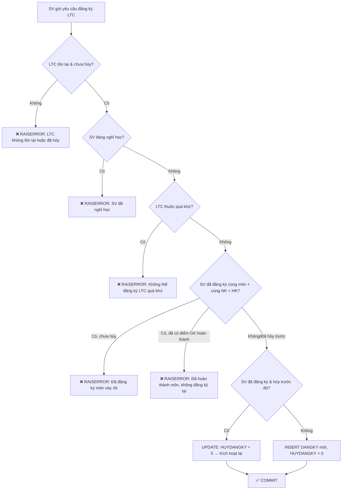

### Chi tiết 7 ràng buộc đăng ký

| # | Ràng buộc | Kiểm tra bằng | Lỗi trả về |
|---|---|---|---|
| 1 | **LTC tồn tại & chưa hủy** | `LOPTINCHI WHERE MALTC = @MALTC AND (HUYLOP = 0 OR HUYLOP IS NULL)` | `N'Lớp tín chỉ không tồn tại hoặc đã bị hủy.'` |
| 2 | **SV không nghỉ học** | `SINHVIEN WHERE MASV = @MASV AND DANGHIHOC = 1` | `N'Sinh viên này đã nghỉ học, không thể đăng ký lớp tín chỉ.'` |
| 3 | **Không đăng ký trong quá khứ** | So sánh NK + HK hiện tại vs NK + HK của LTC | `N'Không thể thao tác trên lớp tín chỉ trong quá khứ.'` |
| 4 | **Chưa đăng ký cùng môn trong cùng HK** | `DANGKY dk JOIN LOPTINCHI ltc WHERE dk.MASV = @MASV AND ltc.MAMH = @MAMH_NEW AND ltc.NIENKHOA = @NIENKHOA_NEW AND ltc.HOCKY = @HOCKY_NEW AND (dk.HUYDANGKY = 0 OR dk.HUYDANGKY IS NULL) AND dk.MALTC <> @MALTC` | `N'Bạn đã đăng ký một lớp khác cho môn học này trong cùng học kỳ.'` |
| 5 | **Chưa hoàn thành môn (DIEM_GK ≥ 5)** | `DANGKY dk JOIN LOPTINCHI ltc WHERE dk.DIEM_GK >= 5 AND (dk.HUYDANGKY = 0 OR dk.HUYDANGKY IS NULL)` | `N'Bạn đã hoàn thành và đạt môn học này rồi, không thể đăng ký lại.'` |
| 6 | **SV đã hủy trước đó** | `DANGKY WHERE MASV = @MASV AND MALTC = @MALTC AND HUYDANGKY = 1` | → UPDATE `HUYDANGKY = 0` (kích hoạt lại) |
| 7 | **Isolation Level** | `SET TRANSACTION ISOLATION LEVEL SERIALIZABLE` | Tránh Race Condition khi nhiều SV đăng ký đồng thời |

### ⚡ Tối ưu đăng ký

```sql
-- Dùng SERIALIZABLE để đảm bảo tính nhất quán
-- Tránh 2 SV cùng đăng ký cùng lúc gây phantom reads
SET TRANSACTION ISOLATION LEVEL SERIALIZABLE;
BEGIN TRAN;
    -- ... kiểm tra + insert ...
COMMIT TRAN;
```

> **Tại sao dùng SERIALIZABLE?** Vì cần đảm bảo khi đọc "SV chưa đăng ký", không có transaction khác chen vào INSERT giữa lúc đọc và lúc ghi. SERIALIZABLE ngăn chặn Phantom Reads.

---

### SP Hủy đăng ký: `sp_HuyDangKyLopTinChi`

**File**: `017-sp_HuyHoacDangKy_LopTinChi.sql`

```
Input: @MASV NVARCHAR(50), @MALTC INT
```

### Quy trình hủy (Flowchart)

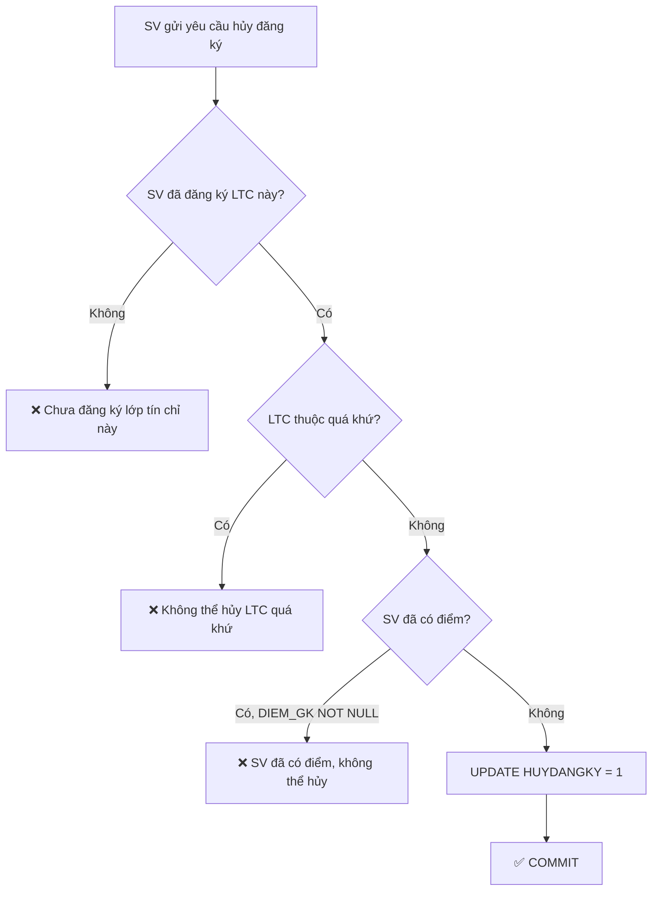

### Chi tiết ràng buộc hủy

| # | Ràng buộc | Lỗi trả về |
|---|---|---|
| 1 | **Phải đã đăng ký** | `N'Chưa đăng ký lớp tín chỉ này.'` |
| 2 | **Không hủy trong quá khứ** | `N'Không thể thao tác trên lớp tín chỉ trong quá khứ.'` |
| 3 | **Chưa có điểm** | `N'Sinh viên đã có điểm, không thể hủy đăng ký lớp tín chỉ này.'` |
| 4 | **Isolation SERIALIZABLE** | Tránh race condition |

> **Lưu ý**: Hủy = `UPDATE HUYDANGKY = 1`, **không phải DELETE**. Bản ghi DANGKY vẫn giữ lại để có thể kích hoạt lại.

---

## IX. Luồng 8: Cập nhật Điểm

### SP: `sp_CapNhatDiem`

**File**: `019-sp_CapNhatDiem.sql` → **Controller**: `GradeController.cs`

### Cơ chế cập nhật hàng loạt (Batch Update)

```sql
-- Sử dụng Table-Valued Parameter (TVP) để gửi nhiều dòng cùng lúc
CREATE TYPE dbo.GradeEntryType AS TABLE (
    MALTC INT,
    MASV  NVARCHAR(15),
    DIEM_CC FLOAT,
    DIEM_GK FLOAT,
    DIEM_CK FLOAT
);

CREATE OR ALTER PROCEDURE sp_CapNhatDiem
    @Grades dbo.GradeEntryType READONLY
AS
BEGIN
    SET NOCOUNT ON;
    BEGIN TRANSACTION;
    BEGIN TRY
        -- Verify: tất cả SV phải đã đăng ký hợp lệ
        -- UPDATE hàng loạt DIEM_CC, DIEM_GK, DIEM_CK
        COMMIT;
    END TRY
    BEGIN CATCH
        ROLLBACK;
        RAISERROR(ERROR_MESSAGE());
    END CATCH
END
```

### Ràng buộc nhập điểm

| Cột | Kiểu | Ràng buộc |
|---|---|---|
| `DIEM_CC` | `INT` | Điểm chuyên cần (0-10) |
| `DIEM_GK` | `FLOAT` | Điểm giữa kỳ |
| `DIEM_CK` | `FLOAT` | Điểm cuối kỳ |
| `MASV` + `MALTC` | FK | SV phải đã đăng ký LTC đó (`DANGKY`) |
| `HUYDANGKY` | Check | Không nhập điểm cho SV đã hủy đăng ký |

### Tối ưu: Table-Valued Parameter

> Thay vì gọi `UPDATE` N lần (N+1 query), dùng TVP gửi **tất cả điểm trong 1 round-trip** đến SQL Server. SP xử lý batch bằng `MERGE` hoặc `UPDATE ... FROM @Grades`.

---

## X. Luồng 9: Xem Bảng điểm & Phiếu điểm

### SP liên quan

| SP | File | Mô tả | Input |
|---|---|---|---|
| `sp_LayDanhSachSinhVienDangKyLopTinChi` | 006 | DS sinh viên đăng ký 1 LTC | `@MALTC` |
| `sp_LayBangDiemMonHocCuaMotLopTinChi` | 007 | Bảng điểm của 1 LTC | `@MALTC` |
| `sp_LayPhieuDiem` | 008 | Phiếu điểm cá nhân SV | `@MASV` |
| `sp_LayBangDiemTongKet` | 009 | Bảng điểm tổng kết SV | `@MASV` |
| `sp_LayThongTinSinhVien` | 015 | Thông tin SV | `@MASV` |

**Controller**: `ReportController.cs`, `GradeController.cs`

### Luồng xem phiếu điểm

```
1. SV/PGV chọn Sinh viên → Gọi sp_LayPhieuDiem(@MASV)
2. SP JOIN: DANGKY → LOPTINCHI → MONHOC
3. Trả về: Tên MH, Nhóm, Niên khóa, HK, Điểm CC/GK/CK
4. Chỉ lấy bản ghi có HUYDANGKY = 0 hoặc NULL
```

### Tối ưu truy vấn bảng điểm

```sql
-- sp_LayBangDiemTongKet: JOIN nhiều bảng
-- Tối ưu: Dùng Covering Index để tránh Key Lookup
-- Index IX_DANGKY_MASV_Cover trên DANGKY(MASV) INCLUDE (MALTC, DIEM_CC, DIEM_GK, DIEM_CK)
```

---

## XI. Luồng 10: Xác thực & Phân quyền

### SP: `sp_DangNhap`, `sp_DangNhap_SinhVien`

**File**: `003-sp_DangNhap.sql`, `004-sp_DangNhap_SinhVien.sql` → **Controller**: `AccountController.cs`

### 3 vai trò trong hệ thống

| Role | SQL Login | Quyền | SP tạo |
|---|---|---|---|
| **PGV** (Phòng Giáo Vụ) | `lcvinh` | CRUD tất cả, nhập điểm, quản lý LTC | `sp_TaoVaiTro` |
| **KHOA** | `ptquanh` | Xem thông tin Khoa, xem bảng điểm | `sp_TaoVaiTro` |
| **SV** (Sinh viên) | `sv` | Xem điểm cá nhân, đăng ký/hủy LTC | `sp_TaoVaiTro` |

### Luồng đăng nhập PGV/KHOA

```
1. User nhập LoginName + Password
2. Controller gọi sp_DangNhap(@LOGIN, @PASS)
3. SP thực hiện: EXECUTE AS LOGIN trên SQL Server
4. Nếu thành công → Tạo Cookie Authentication với Claims (Role, LoginName)
5. Nếu thất bại → RAISERROR
```

### Luồng đăng nhập SV

```
1. SV nhập MASV + Password
2. Controller gọi sp_DangNhap_SinhVien(@MASV, @PASS)
3. SP kiểm tra: SELECT FROM SINHVIEN WHERE MASV = @MASV AND PASSWORD = @PASS
4. Nếu đúng + DANGHIHOC = 0 → Đăng nhập thành công
5. Nếu DANGHIHOC = 1 → Từ chối (nghỉ học)
```

### SP Quản lý Tài khoản: `002-sp_CRUD_TaiKhoan.sql`

| SP | Mô tả | Ràng buộc |
|---|---|---|
| `sp_ThemTaiKhoan` | Tạo SQL Login + User | Password ≥ 8 ký tự |
| `sp_SuaTaiKhoan` | Đổi mật khẩu | Password mới ≥ 8 ký tự |
| `sp_XoaTaiKhoan` | Xóa SQL Login + User | Login phải tồn tại |
| `sp_GanQuyenTaiKhoan` | Gán role cho user | Role phải tồn tại |

---

## XII. Luồng 11: Quên mật khẩu (OTP)

**Controller**: `AccountController.cs` → **SP**: `sp_ResetPasswordSinhVien`

### Quy trình 3 bước

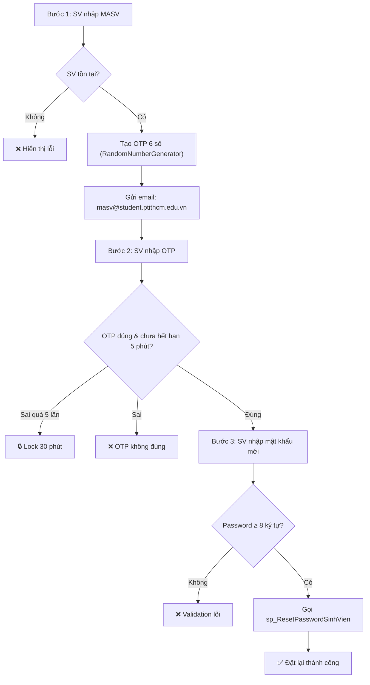

### Rate Limiting OTP

| Giới hạn | Giá trị | Mô tả |
|---|---|---|
| Gửi OTP | **3 lần / 15 phút** / MASV | Tránh spam email |
| Nhập OTP sai | **5 lần** → Lock | Tránh brute-force |
| Thời gian lock | **30 phút** | Sau đó tự mở |
| OTP hết hạn | **5 phút** | Sau 5 phút phải gửi lại |

### Lưu trữ OTP

```csharp
// In-memory ConcurrentDictionary (phù hợp single-instance)
private static readonly ConcurrentDictionary<string, OtpState> ResetOtpCache = new();

private sealed class OtpState
{
    public string Otp { get; set; }
    public DateTime Expiry { get; set; }
    public int RequestCount { get; set; }        // Đếm số lần gửi OTP
    public DateTime FirstRequestTime { get; set; } // Reset sau 15 phút
    public int FailedAttempts { get; set; }       // Đếm lần nhập sai
    public DateTime? LockedUntil { get; set; }    // Thời điểm hết lock
}
```

---

## XIII. Luồng 12: Báo cáo Động (Dynamic Report)

> **Cho phép người dùng PGV tự tạo báo cáo tùy chỉnh bất kỳ mà không cần viết code — chỉ cần chọn bảng, cột, điều kiện lọc.**

**Controller**: `DynamicReportController.cs` → **View**: `DynamicReport/Index`

### Kiến trúc 3 lớp

```
View (JS SPA)  →  Controller (API)  →  Repository (Query Builder)  →  SQL Server
                                    →  DynamicStandardReport (DevExpress PDF)
```

### Quy trình tạo báo cáo (6 bước)

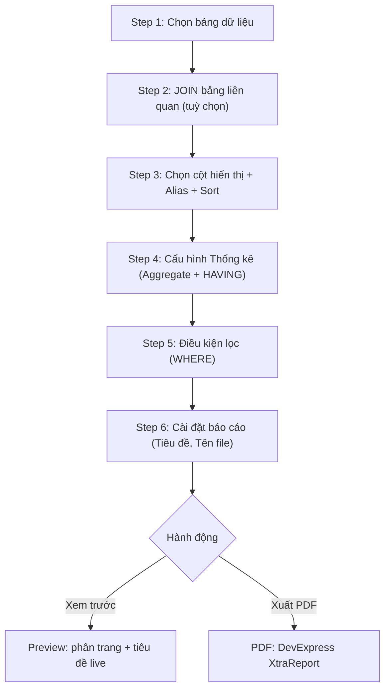

### Luồng kỹ thuật tổng thể: Tạo báo cáo động (End-to-End)

#### Phase 0: Load trang `/DynamicReport`

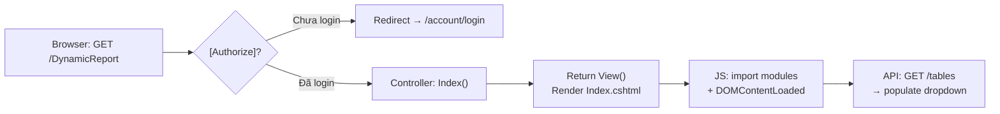

**Chi tiết kỹ thuật:**
1. **Request**: `GET /DynamicReport` → `DynamicReportController.Index()` (`[Authorize]` — bất kỳ role)
2. **View render**: `Index.cshtml` → load CSS + JS modules (ES6 import)
3. **JS Init** (`index.js` → `DOMContentLoaded`):
   - `DOM = {}` → query tất cả selectors từ `constants.js`
   - Gọi `ApiService.getTables()` → `GET /api/dynamic-report/tables`
4. **API Response**: `{ success: true, tables: ["KHOA", "LOP", "SINHVIEN", ...] }`
5. **UI**: Populate `#tableNameSelect` dropdown

---

#### Phase 1: Step 1 — Chọn bảng dữ liệu

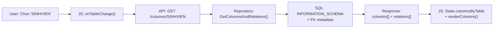

**Chi tiết kỹ thuật:**
1. **Event**: `DOM.tableNameSelect` → `change` → `onTableChange()`
2. **API**: `GET /api/dynamic-report/columns/SINHVIEN`
3. **Controller**: `GetColumns(table)` → validate table name → `GetColumnsAndRelationsAsync()`
4. **Repository**: Query `INFORMATION_SCHEMA.COLUMNS` + `sys.foreign_keys` → trả về:
   - `columns`: `[{ name: "MASV", dataType: "nvarchar", ... }, ...]`
   - `relations`: `[{ table: "LOP", type: "FK", joinColumn: "MALOP" }, ...]`
5. **JS State update**:
   - `State.tableName = "SINHVIEN"`
   - `State.columnsByTable["SINHVIEN"] = columns`
   - `State.availableRelations = relations`
6. **UI**: Render checkboxes cho cột + hiện danh sách bảng JOIN-able

---

#### Phase 2: Step 2 — JOIN bảng liên quan

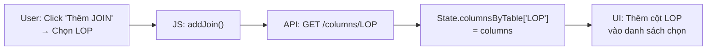

**Chi tiết kỹ thuật:**
1. **Event**: Click nút JOIN → chọn bảng `LOP` từ `State.availableRelations`
2. **API**: `GET /api/dynamic-report/columns/LOP` → lấy cột + FK metadata bảng LOP
3. **JS**: Merge cột LOP vào `State.columnsByTable` → re-render danh sách cột
4. **State**: `Joins: [{ JoinTable: "LOP", JoinType: "INNER" }]`
5. **Repository** (khi query): `BuildJoinClause()` → `INNER JOIN [LOP] ON [LOP].[MALOP] = [SINHVIEN].[MALOP]`
   - Dùng FK metadata tự động detect ON clause

---

#### Phase 3: Step 3 — Chọn cột hiển thị

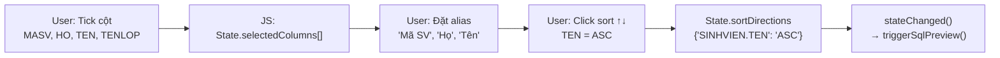

**Chi tiết kỹ thuật:**
1. **Event**: Tick checkbox → `toggleColumn()` → push vào `State.selectedColumns[]`
2. **Alias**: Input field inline → cập nhật `selectedColumns[i].AliasName`
3. **Sort**: Click sort button → cycle `None → ASC → DESC → None` → update `State.sortDirections`
4. **SQL Preview**: `stateChanged()` → debounce 300ms → `ApiService.getSqlPreview(payload)` → hiện SQL real-time
5. **Validation**: Ít nhất 1 cột phải được chọn, nếu không → disable Preview/Export buttons

---

#### Phase 4: Step 4 — Cấu hình Thống kê

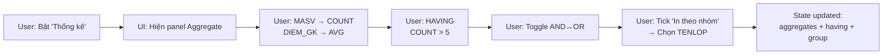

**Chi tiết kỹ thuật:**
1. **Toggle**: `DOM.toggleAggregationBtn` → `State.isAggregationEnabled = true` → hiện aggregation panel
2. **Aggregate**: Dropdown cho mỗi cột chọn: `None | COUNT | SUM | AVG | MIN | MAX`
   - Cập nhật `selectedColumns[i].Aggregate = "COUNT"`
3. **HAVING**: Mỗi cột có aggregate → hiện operator dropdown + value input
   - `selectedColumns[i].HavingOperator = "GreaterThan"`, `HavingValue = "5"`
4. **AND/OR**: `DOM.havingLogicToggle` → `State.havingLogic = "OR"`
5. **Print by Group**: Tick checkbox → `populateGroupByOptions()` fill dropdown từ non-computed columns
   - `State.groupByColumn = "LOP.TENLOP"`, `State.printByGroup = true`
6. **PageBreak**: `State.pageBreakPerGroup = true` (optional)

---

#### Phase 5: Step 5 — Điều kiện lọc (WHERE)

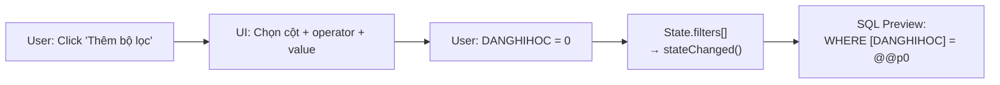

**Chi tiết kỹ thuật:**
1. **Add filter**: Click → thêm row: `[Bảng.Cột] [Operator ▾] [Value]`
2. **Operators**: `=, <>, >, <, >=, <=, LIKE, NOT LIKE, IS NULL, IS NOT NULL`
3. **State**: `Filters: [{ TableName: "SINHVIEN", ColumnName: "DANGHIHOC", Operator: "Equals", Value: "0" }]`
4. **Repository** `ApplyWhereFilters()`:
   - **Parameterized**: `WHERE [SINHVIEN].[DANGHIHOC] = @p0` → `SqlParameter("@p0", "0")`
   - **IS NULL/NOT NULL**: Không cần value → `WHERE [col] IS NULL`
   - **LIKE**: Value tự thêm `%` → `WHERE [col] LIKE @p0` với `@p0 = "%keyword%"`
5. **Multiple filters**: Nối bằng `AND` (WHERE luôn dùng AND)

---

#### Phase 6: Step 6 — Cài đặt báo cáo

```
User: Nhập tiêu đề "DANH SÁCH SINH VIÊN @MAKHOA"
User: Nhập tên file "DSSV_CNTT"
→ State: reportTitle, fileName
→ JS: updateTitlePreview() → Title bar hiện "DANH SÁCH SINH VIÊN CNTT" (live)
```

---

#### Phase 7: Xem trước (Preview)

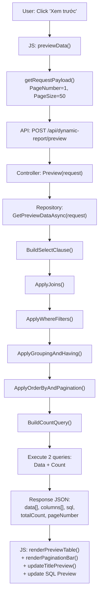

**Chi tiết kỹ thuật:**
1. **JS** `previewData()`:
   - Show loading spinner
   - `getRequestPayload()` → serialize State thành DTO
   - `ApiService.previewData(payload)` → `POST /api/dynamic-report/preview`
2. **Controller** `Preview()`:
   - Validate `ModelState` + `IsTableAllowedAsync()`
   - `GetPreviewDataAsync(request)` → trả `(DataTable, rawSql, totalCount)`
   - Map DataTable → `List<Dictionary<string, object>>` → JSON response
3. **Repository**:
   - Build SQL string qua 6 method chain
   - Execute `DataAdapter.Fill(DataTable)` cho data
   - Execute `ExecuteScalarAsync` cho count
   - Trả `(DataTable dt, string sqlString, int totalCount)`
4. **JS Response handling**:
   - `renderPreviewTable()` — hiện data + group headers (nếu có)
   - `renderPaginationBar()` — "Trang 1 / 15"
   - `highlightSql(result.sql)` → cập nhật SQL Preview
   - `updateTitlePreview()` → cập nhật title bar

---

#### Phase 8: Xuất PDF

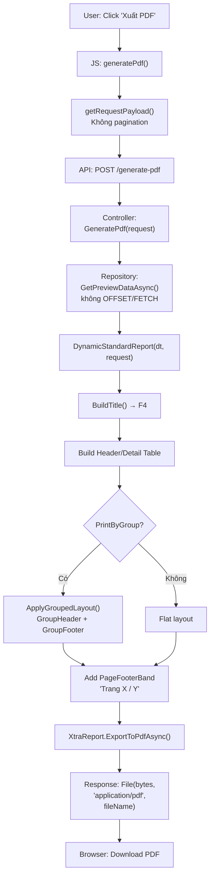

**Chi tiết kỹ thuật:**
1. **JS** `generatePdf()`:
   - `getRequestPayload()` — **không gửi pagination** (lấy toàn bộ data)
   - `POST /api/dynamic-report/generate-pdf` với `responseType: blob`
2. **Controller** `GeneratePdf()`:
   - `GetPreviewDataAsync(request)` với `isPagination = false` → không OFFSET/FETCH
   - `new DynamicStandardReport(dataTable, request)` → tạo XtraReport
3. **Report constructor**:
   - Auto-detect: > 6 cột → A3 Landscape, ≤ 6 → A4 Portrait
   - `BuildTitle()` — F4: thay `@PARAM` bằng filter values
   - Build `PageHeaderBand` (header table) + `DetailBand` (data rows)
   - Nếu `PrintByGroup`: parse `"Table.Column"` → match DataTable column → `ApplyGroupedLayout()`
   - `PageFooterBand` → `XRPageInfo("Trang {0} / {1}")`
4. **Export**: `report.ExportToPdfAsync(memoryStream)` → `File(bytes, "application/pdf", fileName)`
5. **Browser**: Auto-download file `DSSV_CNTT.pdf`

---

#### Sequence Diagram tổng hợp

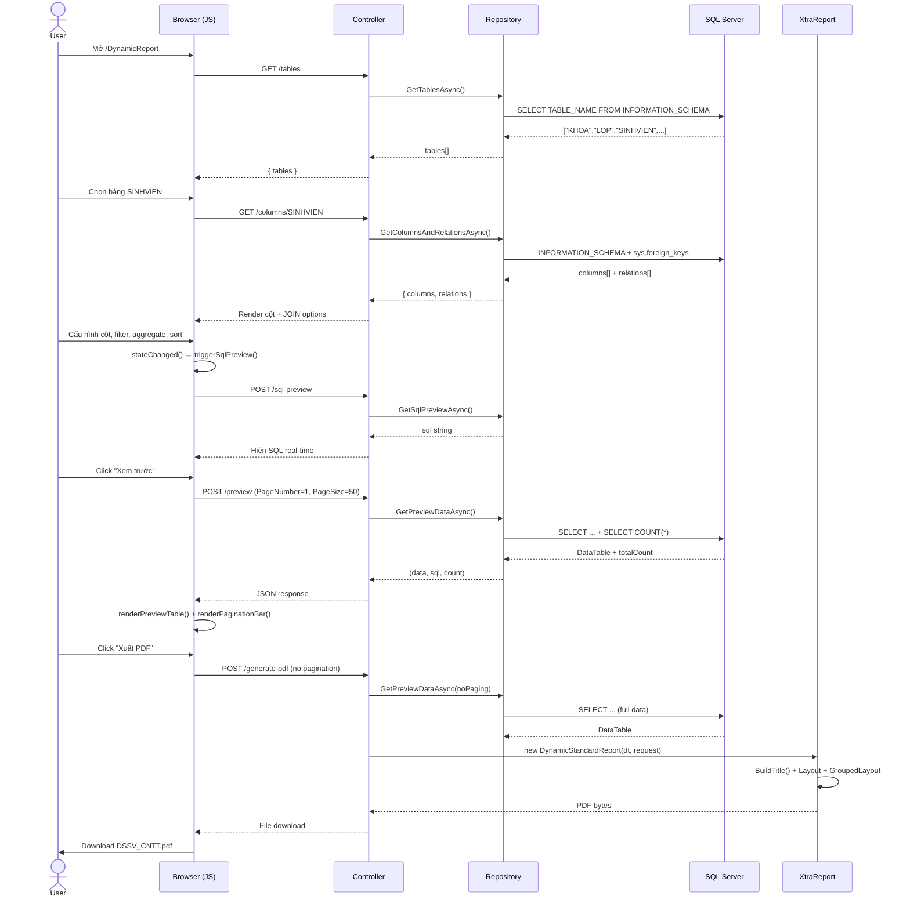

### Các tính năng chính

| # | Tính năng | Mô tả |
|---|---|---|
| F1 | **Standalone Aggregates** | SUM/AVG/COUNT/MIN/MAX không cần GROUP BY (VD: tổng SV toàn trường) |
| F2 | **ORDER BY ASC/DESC** | Người dùng click icon ↑↓ trên mỗi cột để sắp xếp (3 trạng thái: None→ASC→DESC→None) |
| F3 | **HAVING AND/OR** | Toggle AND/OR cho điều kiện lọc sau khi gom nhóm |
| F4 | **@PARAM Title** | Tiêu đề báo cáo có tham số: `DANH SÁCH SV @MAKHOA` → `DANH SÁCH SV CNTT` |
| F5 | **Print by Group** | In PDF theo nhóm với GroupHeader/GroupFooter + tùy chọn sang trang mới mỗi nhóm |
| F6 | **Phân trang** | Preview: dropdown 10/25/50/100 dòng + nút ◀▶. PDF: footer "Trang X / Y" |
| F7 | **Smart Validation** | CSS chuẩn bị cho cảnh báo validation (VD: @PARAM không trùng cột) |
| F8 | **Guide Panel** | Sidebar hướng dẫn nhanh: "Muốn A → Cần làm gì?" + ràng buộc cần biết |

### DTOs

| DTO | Mục đích |
|---|---|
| `DynamicQueryRequestDto` | Request chính: TableName, Joins, AdvancedSelectColumns, Filters, OrderByColumns, HavingLogic, PrintByGroup, GroupByColumn, PageBreakPerGroup, ReportTitle, FileName, PageNumber, PageSize |
| `OrderByDefinition` | Định nghĩa sort: TableName, ColumnName, Descending |
| `ColumnSelection` | Cột chọn: TableName, ColumnName, Expression, Aggregate, AliasName, HavingOperator, HavingValue, IsComputed |
| `JoinDefinition` | JOIN: JoinTable, JoinType |
| `FilterCondition` | WHERE: TableName, ColumnName, Operator (enum), Value |

### Repository: Query Builder

**File**: `DynamicReportRepository.cs`

```
GetPreviewDataAsync(request) → (DataTable Data, string Sql, int TotalCount)
```

#### Chiến lược xây SQL

```sql
-- 1. BuildSelectClause: Xác định SELECT + GROUP BY
--    Nếu TẤT CẢ cột đều có Aggregate → không GROUP BY (standalone)
--    Nếu HỖN HỢP raw + aggregate → GROUP BY các cột raw

-- 2. ApplyJoins: INNER JOIN / LEFT JOIN dựa trên FK Metadata

-- 3. ApplyWhereFilters: WHERE conditions (parameterized)
--    Operators: =, <>, >, <, >=, <=, LIKE, NOT LIKE, IS NULL, IS NOT NULL

-- 4. ApplyGroupingAndHaving: GROUP BY + HAVING (AND | OR)

-- 5. ApplyOrderByAndPagination: ORDER BY user-defined → OFFSET/FETCH

-- 6. BuildCountQuery: SELECT COUNT(*) với cùng FROM/WHERE/GROUP BY
```

#### Ví dụ SQL sinh ra

```sql
-- Đếm SV mỗi Khoa, sắp theo SoSV giảm dần, chỉ lấy Khoa > 10 SV
SELECT [KHOA].[TENKHOA], COUNT([SINHVIEN].[MASV]) AS [SoSV]
FROM [SINHVIEN]
INNER JOIN [LOP] ON [LOP].[MALOP] = [SINHVIEN].[MALOP]
INNER JOIN [KHOA] ON [KHOA].[MAKHOA] = [LOP].[MAKHOA]
GROUP BY [KHOA].[TENKHOA]
HAVING COUNT([SINHVIEN].[MASV]) > 10
ORDER BY [SoSV] DESC
OFFSET 0 ROWS FETCH NEXT 50 ROWS ONLY;
```

### Report PDF: DevExpress XtraReport

**File**: `DynamicStandardReport.cs`

| Thành phần | Mô tả |
|---|---|
| `BuildTitle()` | Thay thế `@COLUMN_NAME` trong tiêu đề bằng giá trị filter tương ứng |
| `ApplyGroupedLayout()` | Tạo GroupHeaderBand + GroupFooterBand khi PrintByGroup = true |
| `PageBreakPerGroup` | `GroupHeaderBand.PageBreak = PageBreak.BeforeBand` |
| `PageFooterBand` | XRPageInfo hiển thị "Trang X / Y" ở footer mỗi trang PDF |
| Auto Landscape | Tự chuyển ngang nếu > 6 cột |

### Controller Endpoints

| Endpoint | Method | Mô tả |
|---|---|---|
| `/DynamicReport` | GET | Trang chính (Index view) |
| `/api/dynamic-report/tables` | GET | Danh sách bảng/view |
| `/api/dynamic-report/columns/{table}` | GET | Danh sách cột + FK metadata |
| `/api/dynamic-report/preview` | POST | Preview data (paginated) → JSON |
| `/api/dynamic-report/generate-pdf` | POST | Xuất PDF → file download |

### Ràng buộc nghiệp vụ Dynamic Report

| # | Ràng buộc | Tầng xử lý |
|---|---|---|
| 1 | `@PARAM` trong tiêu đề phải IN HOA, trùng tên cột, và cột đó phải có filter | Client (JS hint) + Server (BuildTitle) |
| 2 | Khi bật GROUP BY: cột group tự động nằm trong SELECT | Repository (BuildSelectClause) |
| 3 | HavingLogic chỉ chấp nhận "AND" hoặc "OR" | Repository (whitelist validation) |
| 4 | SQL injection prevention: tất cả giá trị dùng SqlParameter | Repository (parameterized) |
| 5 | Table/Column names chỉ cho phép ký tự `[a-zA-Z0-9_]` | Repository (SanitizeName) |
| 6 | Standalone aggregate (all columns have aggregate) → không GROUP BY | Repository (BuildSelectClause) |
| 7 | JOIN type chỉ chấp nhận INNER/LEFT | Repository (whitelist) |

### Luồng kỹ thuật từng tính năng

#### F1: Standalone Aggregates (SUM/AVG/COUNT/MIN/MAX không GROUP BY)

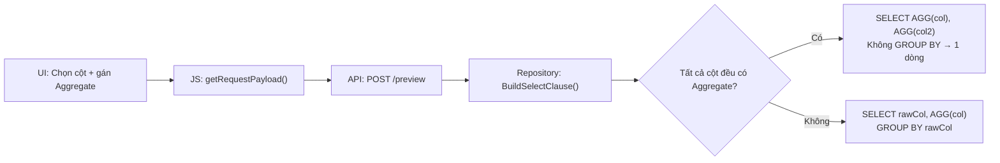

**Luồng chi tiết:**
1. **UI** (Step 3+4): User chọn cột `MASV`, gán `COUNT`. Không chọn cột raw nào.
2. **JS** `getRequestPayload()`: `AdvancedSelectColumns: [{ ColumnName: "MASV", Aggregate: "COUNT" }]`
3. **Controller** `Preview()`: Nhận request, gọi `GetPreviewDataAsync()`
4. **Repository** `BuildSelectClause()`: Detect all columns có Aggregate → skip `GROUP BY`
5. **SQL**: `SELECT COUNT([SINHVIEN].[MASV]) AS [SoSV] FROM [SINHVIEN]` → trả về 1 dòng duy nhất
6. **Response**: `{ data: [{ SoSV: 150 }], totalCount: 1 }`

---

#### F2: ORDER BY ASC/DESC

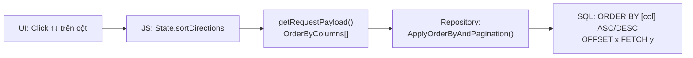

**Luồng chi tiết:**
1. **UI** (Step 3): Click icon sort → cycle: None → ASC (⬆) → DESC (⬇) → None
2. **JS**: `State.sortDirections["SINHVIEN.TEN"] = "DESC"` → serialize thành `OrderByColumns: [{ TableName: "SINHVIEN", ColumnName: "TEN", Descending: true }]`
3. **Repository** `ApplyOrderByAndPagination()`: Build `ORDER BY [SINHVIEN].[TEN] DESC`
4. Nếu `PrintByGroup` active: group column được **prepend** vào đầu ORDER BY

---

#### F3: HAVING AND/OR

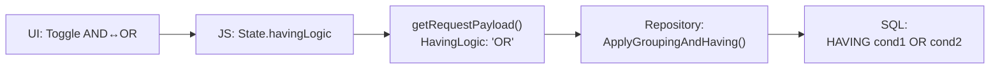

**Luồng chi tiết:**
1. **UI** (Step 4 header): Click toggle → `AND` chuyển thành `OR` (hoặc ngược lại)
2. **JS**: `State.havingLogic = "OR"` → gửi trong payload
3. **Repository** `ApplyGroupingAndHaving()`:
   - Whitelist validation: chỉ chấp nhận `"AND"` hoặc `"OR"`, mặc định `"AND"`
   - Với mỗi cột có `HavingOperator + HavingValue`:
     ```sql
     -- HavingLogic = "OR"
     HAVING COUNT([MASV]) > @h0
        OR AVG([DIEM_GK]) >= @h1
     ```
4. **SQL Parameter**: `@h0 = 10, @h1 = 5.0` (parameterized, chống SQL injection)

---

#### F4: @PARAM Title Interpolation

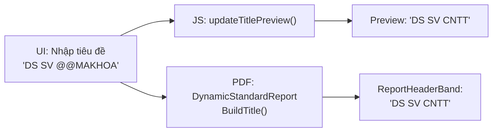

**Luồng chi tiết:**
1. **UI** (Step 6): User nhập `DANH SÁCH SINH VIÊN @MAKHOA`
2. **JS** `updateTitlePreview(payload)`:
   - Tìm filter có `ColumnName = "MAKHOA"` → lấy `Value = "CNTT"`
   - Replace `@MAKHOA` → `CNTT` → hiện **live preview** trên title bar
3. **Report** `BuildTitle()`: Cùng logic thay thế, case-insensitive
   - `@makhoa`, `@MAKHOA`, `@MaKhoa` → đều match
4. **Razor escaping**: Trong `.cshtml`, dùng `@@MAKHOA` (double @) để Razor không parse

---

#### F5: Print by Group + PageBreak

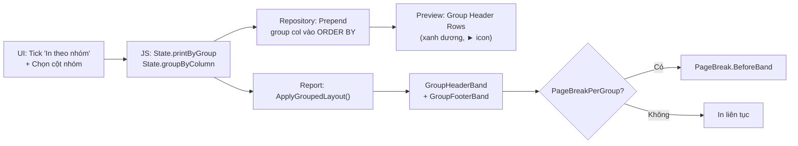

**Luồng chi tiết:**
1. **UI** (Step 4): Tick checkbox → hiện dropdown → chọn cột nhóm (VD: `LOP.TENLOP`)
2. **JS**: `populateGroupByOptions()` fill dropdown từ `State.selectedColumns`
3. **Repository**: Detect `GroupByColumn = "LOP.TENLOP"` → prepend `ORDER BY [LOP].[TENLOP] ASC, ...`
4. **Preview** `renderPreviewTable()`:
   - Detect group value thay đổi → chèn `<tr class="dr-group-header-row">` (colored bar)
   - Data hiển thị **liên tục nhưng tách nhóm bằng header row**
5. **Report** `DynamicStandardReport`:
   - Parse `"LOP.TENLOP"` → extract `"TENLOP"` → match DataTable column
   - `GroupHeaderBand`: hiện `"► Lớp_Tên"` trên nền xanh
   - `GroupFooterBand`: hiện `"Tổng cộng nhóm: X dòng"`
   - Nếu `PageBreakPerGroup = true`: mỗi nhóm bắt đầu trang mới

---

#### F6: Phân trang (Preview + PDF)

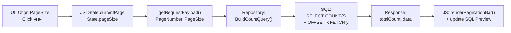

**Luồng chi tiết:**
1. **Preview**: Dropdown chọn 10/25/50/100 dòng → `State.pageSize`, nút ◀▶ → `State.currentPage`
2. **Repository**: 2 query chạy song song:
   - **Count query**: `SELECT COUNT(*) FROM ... WHERE ... GROUP BY ...` → `totalCount`
   - **Data query**: `SELECT ... ORDER BY ... OFFSET (page-1)*size ROWS FETCH NEXT size ROWS ONLY`
3. **JS**: `renderPaginationBar()` → hiện `"Trang 2 / 15"`, disable nút khi đầu/cuối
4. **SQL Preview**: `result.sql` từ API → update `sqlPreviewCode` → hiện đúng OFFSET/FETCH
5. **PDF**: `PageFooterBand` → `XRPageInfo` → `"Trang {0} / {1}"` (DevExpress auto-calculate)

---

#### F8: Guide Panel (Hướng dẫn)

```
UI: Click nút "?" (bottom-right) → Sidebar slide từ phải
    ├── Tab "Cách dùng": Step-by-step recipes
    ├── Tab "Ràng buộc": Validation rules
    └── Nút ✕ đóng panel
CSS: .guide-panel { transform: translateX(100%) → translateX(0) }
JS: Toggle class "active" trên #guidePanel
```

---

### Phân quyền theo Role

#### Ma trận quyền truy cập chức năng

| Controller | Chức năng | PGV | KHOA | SV |
|---|---|:---:|:---:|:---:|
| `FacultyController` | Xem danh sách Khoa | ✅ | ✅ | ❌ |
| `FacultyController` | Thêm/Sửa/Xóa Khoa | ✅ | ❌ | ❌ |
| `ClassController` | Xem danh sách Lớp | ✅ | ✅ | ❌ |
| `ClassController` | Thêm/Sửa/Xóa Lớp | ✅ | ❌ | ❌ |
| `StudentController` | Xem danh sách SV | ✅ | ✅ | ❌ |
| `StudentController` | Thêm/Sửa/Xóa SV | ✅ | ❌ | ❌ |
| `StudentController` | Xem thông tin cá nhân | ❌ | ❌ | ✅ |
| `LecturerController` | Xem danh sách GV | ✅ | ✅ | ❌ |
| `LecturerController` | Thêm/Sửa/Xóa GV | ✅ | ❌ | ❌ |
| `SubjectController` | Xem danh sách Môn học | ✅ | ✅ | ❌ |
| `SubjectController` | Thêm/Sửa/Xóa Môn học | ✅ | ❌ | ❌ |
| `CreditClassController` | Xem danh sách LTC | ✅ | ✅ | ❌ |
| `CreditClassController` | Thêm/Sửa/Xóa LTC | ✅ | ❌ | ❌ |
| `RegistrationController` | SV đăng ký/hủy LTC | ❌ | ❌ | ✅ |
| `AdminRegistrationController` | PGV đăng ký hộ SV | ✅ | ❌ | ❌ |
| `GradeController` | Xem/Nhập điểm | ✅ | ✅ | ❌ |
| `ReportController` | Bảng điểm LTC | ✅ | ✅ | ❌ |
| `ReportController` | Phiếu điểm cá nhân | ✅ | ✅ | ✅ |
| `DynamicReportController` | Báo cáo Động | ✅ | ✅ | ✅ |
| `AccountController` | CRUD tài khoản SQL | ✅ | ✅ | ❌ |
| `AccountController` | Gán quyền (Role) | ✅ | ❌ | ❌ |

> **Ghi chú**:
> - `Faculty` = PGV + KHOA (cả hai đều thuộc nhóm Faculty, nhưng PGV có thêm quyền CUD)
> - `[Authorize]` (không Roles) = tất cả user đã đăng nhập

#### Cơ chế phân quyền kỹ thuật

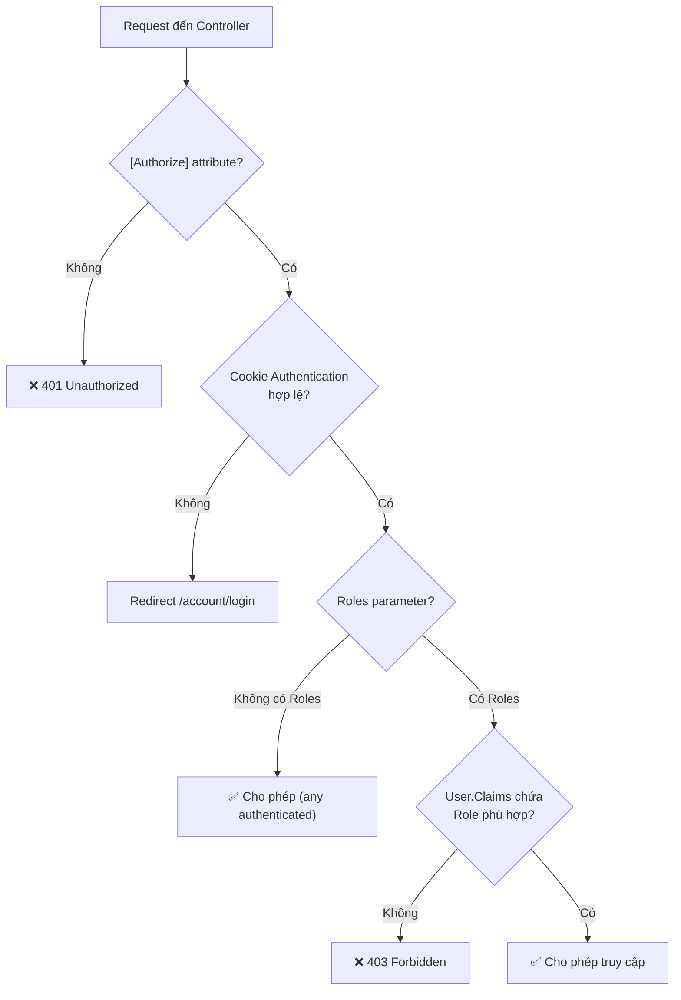

#### Luồng kỹ thuật theo từng vai trò

##### PGV (Phòng Giáo Vụ) — Full Access

```
1. Đăng nhập: sp_DangNhap(@LOGIN, @PASS) → Cookie với Claims { Role: "PGV", LoginName: "lcvinh" }
2. Truy cập: TẤT CẢ controller (Faculty ∩ PGV)
3. Đặc quyền: CRUD mọi thực thể + nhập điểm + quản lý tài khoản + gán quyền
4. Dynamic Report: Truy cập /DynamicReport → Tạo báo cáo tùy chỉnh bất kỳ
5. Báo cáo cố định: Bảng điểm LTC, Phiếu điểm SV, Bảng điểm tổng kết
```

##### KHOA — Read-Only + Báo cáo

```
1. Đăng nhập: sp_DangNhap(@LOGIN, @PASS) → Cookie với Claims { Role: "KHOA", LoginName: "ptquanh" }
2. Truy cập: Chỉ Faculty-level controllers (xem danh sách)
3. Hạn chế: KHÔNG có quyền CUD (Thêm/Sửa/Xóa) → nhận 403 nếu thử
4. Dynamic Report: Truy cập /DynamicReport → Tạo báo cáo tùy chỉnh
5. Báo cáo cố định: Bảng điểm LTC, Phiếu điểm SV
```

##### SV (Sinh viên) — Self-Service

```
1. Đăng nhập: sp_DangNhap_SinhVien(@MASV, @PASS) → Cookie với Claims { Role: "SV", MASV: "SV001" }
2. Truy cập: Chỉ RegistrationController + StudentController (thông tin cá nhân)
3. Đặc quyền: Đăng ký/hủy LTC, Xem phiếu điểm cá nhân
4. Dynamic Report: Truy cập /DynamicReport → Tạo báo cáo tùy chỉnh
5. Hạn chế: KHÔNG xem danh sách SV khác, KHÔNG nhập điểm, KHÔNG quản lý
```

### Frontend Architecture

```
wwwroot/js/dynamic-report/
├── index.js              ← Entry point, event handlers, business logic
├── constants.js          ← DOM selectors, API endpoints, enum mappings
└── modules/
    ├── state-manager.js  ← State object (reactive, single source of truth)
    ├── ui-manager.js     ← DOM rendering (columns, aggregation, preview table)
    ├── api-service.js    ← Fetch wrapper cho API calls
    └── helpers.js        ← escapeHtml, sanitize, utility functions
```

---

## XIV. Chiến lược tối ưu (Indexes)

**File**: `002-Indexes.sql`

### Nguyên tắc thiết kế Index

```
QUY TẮC HIỆU SUẤT TỐI ƯU CỦA SQL:
1. Cột trong WHERE / JOIN ON  → Cho vào KEY của Index
2. Cột trong SELECT (không lọc) → Cho vào INCLUDE
→ Query Engine đọc trực tiếp từ Index Tree, không cần Lookup về bảng gốc
```

### Danh sách Covering Indexes

| Index | Bảng | Key Columns | Include Columns | Hỗ trợ SP |
|---|---|---|---|---|
| `IX_LOPTINCHI_FilterKhoaNienKhoa` | `LOPTINCHI` | `MAKHOA, NIENKHOA, HOCKY` | `MALTC, MAMH, MAGV, NHOM, SOSVTOITHIEU` | `sp_LayDanhSachLopTinChi` (005) |
| `IX_LOPTINCHI_FilterLopTinChi` | `LOPTINCHI` | `MAMH, NHOM` | *(các cột cần)* | `sp_LayDanhSachSinhVienDangKyLopTinChi` (006), `sp_LayBangDiemMonHoc` (007) |

### Tại sao Covering Index hiệu quả?

```
Trước Index:                        Sau Covering Index:
┌──────────────────┐               ┌──────────────────┐
│ Query Plan:       │               │ Query Plan:       │
│ 1. Index Seek     │               │ 1. Index Seek     │
│ 2. Key Lookup ❌  │               │    (ALL data in   │
│    (quay về bảng)│               │     index tree)   │
│ 3. Nested Loop    │               │ → Không Lookup!   │
└──────────────────┘               └──────────────────┘
Cost: ~5x chậm hơn                 Cost: Tối ưu nhất
```

---

## XV. Tổng hợp SP & Controller Mapping

### Bảng tra nhanh: SP → Controller → Vai trò

| # | SP | Controller | Chức năng | Vai trò |
|---|---|---|---|---|
| 001 | `sp_TaoVaiTro` | *(Setup)* | Tạo Database Roles | Admin |
| 002 | `sp_ThemTaiKhoan` / `sp_SuaTaiKhoan` / `sp_XoaTaiKhoan` | `AccountController` | CRUD tài khoản SQL | PGV |
| 003 | `sp_DangNhap` | `AccountController` | Đăng nhập PGV/KHOA | All |
| 004 | `sp_DangNhap_SinhVien` | `AccountController` | Đăng nhập SV | SV |
| 005 | `sp_ThemLopTinChi` / `sp_SuaLopTinChi` / `sp_XoaLopTinChi` | `CreditClassController` | CRUD lớp tín chỉ | PGV |
| 006 | `sp_LayDanhSachSinhVienDangKyLopTinChi` | `RegistrationController` | DS SV đăng ký 1 LTC | PGV, KHOA |
| 007 | `sp_LayBangDiemMonHocCuaMotLopTinChi` | `GradeController` | Bảng điểm 1 LTC | PGV |
| 008 | `sp_LayPhieuDiem` | `ReportController` | Phiếu điểm SV | PGV, SV |
| 009 | `sp_LayBangDiemTongKet` | `ReportController` | Bảng điểm tổng kết | PGV, SV |
| 010 | `sp_ThemLop` / `sp_SuaLop` / `sp_XoaLop` | `ClassController` | CRUD lớp | PGV |
| 011 | `sp_ThemSinhVien` / `sp_CapNhatSinhVien` / `sp_XoaSinhVien` | `StudentController` | CRUD sinh viên | PGV |
| 012 | `sp_PhanTrangDong` | *(Shared)* | Phân trang động | All |
| 013 | `sp_ThemGiangVien` / `sp_SuaGiangVien` / `sp_XoaGiangVien` | `LecturerController` | CRUD giảng viên | PGV |
| 014 | `sp_ThemMonHoc` / `sp_SuaMonHoc` / `sp_XoaMonHoc` | `SubjectController` | CRUD môn học | PGV |
| 015 | `sp_LayThongTinSinhVien` | `StudentController` | Chi tiết SV | PGV, SV |
| 016 | `sp_LopTinChi_SinhVien` | `RegistrationController` | DS LTC mà SV đang đăng ký | SV |
| 017 | `sp_DangKyLopTinChi` / `sp_HuyDangKyLopTinChi` | `RegistrationController` | Đăng ký / Hủy LTC | PGV, SV |
| 018 | `sp_ThemKhoa` / `sp_SuaKhoa` / `sp_XoaKhoa` | `FacultyController` | CRUD khoa | PGV |
| 019 | `sp_CapNhatDiem` | `GradeController` | Cập nhật điểm hàng loạt (TVP) | PGV |
| 020 | `sp_ResetPasswordSinhVien` | `AccountController` | Reset mật khẩu SV | SV |

### Bảng tra nhanh: Controller → View

| Controller | Views | Mô tả |
|---|---|---|
| `AccountController` | `Login`, `ForgotPassword` | Đăng nhập, quên MK |
| `AdminRegistrationController` | `Index` | PGV đăng ký hộ SV |
| `CreditClassController` | `Index`, `Create`, `Edit` | Quản lý LTC |
| `GradeController` | `Index`, `Edit` | Nhập/sửa điểm |
| `RegistrationController` | `Index` | SV đăng ký LTC |
| `ReportController` | `GradesReport`, `TranscriptReport` | Xuất phiếu điểm |
| `DynamicReportController` | `Index` | Báo cáo động (tạo báo cáo tùy chỉnh) |
| `StudentController` | `Index`, `Create`, `Edit` | Quản lý SV |
| `ClassController` | `Index`, `Create`, `Edit` | Quản lý Lớp |
| `FacultyController` | `Index`, `Create`, `Edit` | Quản lý Khoa |
| `LecturerController` | `Index`, `Create`, `Edit` | Quản lý GV |
| `SubjectController` | `Index`, `Create`, `Edit` | Quản lý Môn học |

---

## Phụ lục: Tổng hợp ràng buộc nghiệp vụ

| # | Ràng buộc | Tầng xử lý | Loại |
|---|---|---|---|
| 1 | Không tạo/sửa/đăng ký LTC trong quá khứ | SP (SQL) | Thời gian |
| 2 | SV nghỉ học không đăng ký LTC | SP (SQL) | Trạng thái |
| 3 | Không đăng ký trùng môn cùng HK | SP (SQL) | Nghiệp vụ |
| 4 | Không đăng ký lại môn đã đạt (DIEM_GK ≥ 5) | SP (SQL) | Nghiệp vụ |
| 5 | Không hủy đăng ký nếu đã có điểm | SP (SQL) | Nghiệp vụ |
| 6 | Password ≥ 8 ký tự | SP + C# Model | Validation |
| 7 | OTP rate limit 3/15 phút | C# Controller | Bảo mật |
| 8 | OTP lock sau 5 lần sai | C# Controller | Bảo mật |
| 9 | Không xóa Khoa/Lớp/GV/MH nếu còn FK tham chiếu | SQL FK Constraint | Toàn vẹn |
| 10 | SERIALIZABLE isolation cho đăng ký/hủy LTC | SP (SQL) | Concurrency |
| 11 | Batch update điểm qua TVP (1 round-trip) | SP (SQL) | Performance |
| 12 | Covering Indexes cho truy vấn nặng | Index Script | Performance |
| 13 | Dynamic Report: SQL injection prevention (parameterized + sanitize) | C# Repository | Bảo mật |
| 14 | Dynamic Report: @PARAM title interpolation (case-insensitive) | C# Report + JS | Nghiệp vụ |
| 15 | Dynamic Report: Standalone aggregate (all agg → no GROUP BY) | C# Repository | Nghiệp vụ |
| 16 | Dynamic Report: HavingLogic whitelist (AND/OR only) | C# Repository | Validation |
| 17 | Dynamic Report: Table/Column name sanitization `[a-zA-Z0-9_]` | C# Repository | Bảo mật |
