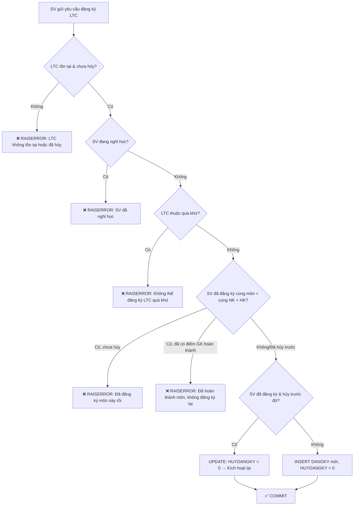
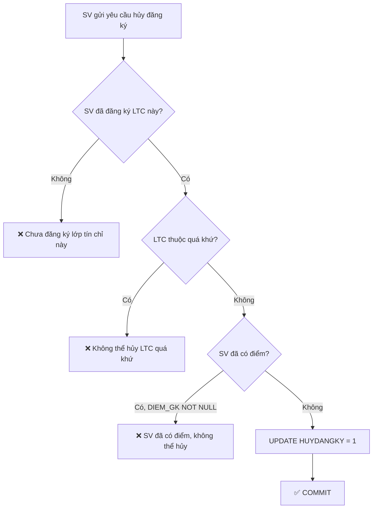
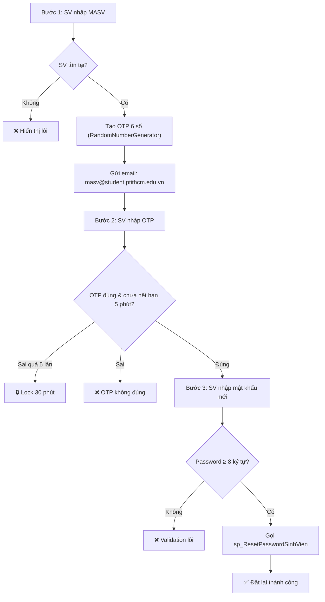

# Luồng Nghiệp Vụ & Ràng Buộc — Hệ Thống QLDSV_HTC

> Tài liệu mô tả toàn bộ luồng nghiệp vụ, Stored Procedures, ràng buộc dữ liệu, và chiến lược tối ưu của hệ thống Quản Lý Điểm Sinh Viên Hệ Tín Chỉ.

---

## Mục lục

- [I. Sơ đồ CSDL & Quan hệ](#i-sơ-đồ-csdl--quan-hệ)
- [II. Luồng 1: Quản lý Khoa](#ii-luồng-1-quản-lý-khoa)
- [III. Luồng 2: Quản lý Lớp](#iii-luồng-2-quản-lý-lớp)
- [IV. Luồng 3: Quản lý Sinh viên](#iv-luồng-3-quản-lý-sinh-viên)
- [V. Luồng 4: Quản lý Giảng viên](#v-luồng-4-quản-lý-giảng-viên)
- [VI. Luồng 5: Quản lý Môn học](#vi-luồng-5-quản-lý-môn-học)
- [VII. Luồng 6: Quản lý Lớp Tín Chỉ](#vii-luồng-6-quản-lý-lớp-tín-chỉ)
- [VIII. Luồng 7: Đăng ký / Hủy Lớp Tín Chỉ](#viii-luồng-7-đăng-ký--hủy-lớp-tín-chỉ)
- [IX. Luồng 8: Cập nhật Điểm](#ix-luồng-8-cập-nhật-điểm)
- [X. Luồng 9: Xem Bảng điểm & Phiếu điểm](#x-luồng-9-xem-bảng-điểm--phiếu-điểm)
- [XI. Luồng 10: Xác thực & Phân quyền](#xi-luồng-10-xác-thực--phân-quyền)
- [XII. Luồng 11: Quên mật khẩu (OTP)](#xii-luồng-11-quên-mật-khẩu-otp)
- [XIII. Chiến lược tối ưu (Indexes)](#xiii-chiến-lược-tối-ưu-indexes)
- [XIV. Tổng hợp SP & Controller Mapping](#xiv-tổng-hợp-sp--controller-mapping)

---

## I. Sơ đồ CSDL & Quan hệ

### Bảng & Cột chính

```
KHOA (MAKHOA PK, TENKHOA)
  │
  ├──> LOP (MALOP PK, TENLOP, KHOAHOC, MAKHOA FK)
  │      │
  │      └──> SINHVIEN (MASV PK, HO, TEN, PHAI, DIACHI, NGAYSINH, MALOP FK, DANGHIHOC, PASSWORD)
  │
  ├──> GIANGVIEN (MAGV PK, MAKHOA FK, HO, TEN, HOCVI, HOCHAM, CHUYENMON)
  │
  └──> LOPTINCHI (MALTC PK IDENTITY, NIENKHOA, HOCKY, MAMH FK, NHOM, MAGV FK, MAKHOA FK, SOSVTOITHIEU, HUYLOP)
              │
              └──> DANGKY (MALTC+MASV PK, DIEM_CC, DIEM_GK, DIEM_CK, HUYDANGKY)

MONHOC (MAMH PK, TENMH, SOTIET_LT, SOTIET_TH)
```

### Quan hệ FK

| FK | Bảng Con → Bảng Cha | Cột |
|---|---|---|
| FK_LOP_KHOA | `LOP` → `KHOA` | `MAKHOA` |
| FK_SV_LOP | `SINHVIEN` → `LOP` | `MALOP` |
| FK_GV_KHOA | `GIANGVIEN` → `KHOA` | `MAKHOA` |
| FK_LTC_MH | `LOPTINCHI` → `MONHOC` | `MAMH` |
| FK_LTC_GV | `LOPTINCHI` → `GIANGVIEN` | `MAGV` |
| FK_LTC_KHOA | `LOPTINCHI` → `KHOA` | `MAKHOA` |
| FK_DK_LTC | `DANGKY` → `LOPTINCHI` | `MALTC` |
| FK_DK_SV | `DANGKY` → `SINHVIEN` | `MASV` |

### Giá trị mặc định quan trọng

| Bảng | Cột | Default | Ý nghĩa |
|---|---|---|---|
| `SINHVIEN` | `PHAI` | `0` (false) | 0 = Nam, 1 = Nữ |
| `SINHVIEN` | `DANGHIHOC` | `0` (false) | 0 = Đang học, 1 = Nghỉ học |
| `SINHVIEN` | `PASSWORD` | `'12345678'` | Mật khẩu mặc định |
| `LOPTINCHI` | `HUYLOP` | `0` (false) | 0 = Hoạt động, 1 = Đã hủy |

---

## II. Luồng 1: Quản lý Khoa

### SP: `sp_ThemKhoa`, `sp_SuaKhoa`, `sp_XoaKhoa`

**File**: `018-sp_CRUD_Khoa.sql` → **Controller**: `FacultyController.cs`

| Thao tác | SP | Ràng buộc |
|---|---|---|
| **Thêm** | `sp_ThemKhoa(@MAKHOA, @TENKHOA)` | `MAKHOA` là PK, không trùng |
| **Sửa** | `sp_SuaKhoa(@MAKHOA, @TENKHOA)` | Phải tồn tại `MAKHOA` |
| **Xóa** | `sp_XoaKhoa(@MAKHOA)` | Không xóa được nếu còn LOP, GIANGVIEN, hoặc LOPTINCHI tham chiếu |

> **Ràng buộc tham chiếu**: Khoa là bảng gốc — nếu xóa Khoa khi còn Lớp/GV/LTC sẽ vi phạm FK constraint → SQL Server trả lỗi.

---

## III. Luồng 2: Quản lý Lớp

### SP: `sp_ThemLop`, `sp_SuaLop`, `sp_XoaLop`

**File**: `010-sp_CRUD_Lop.sql` → **Controller**: `ClassController.cs`

| Thao tác | SP | Ràng buộc |
|---|---|---|
| **Thêm** | `sp_ThemLop(@MALOP, @TENLOP, @KHOAHOC, @MAKHOA)` | `MAKHOA` phải tồn tại trong KHOA |
| **Sửa** | `sp_SuaLop(...)` | `MALOP` phải tồn tại |
| **Xóa** | `sp_XoaLop(@MALOP)` | Không xóa được nếu còn SINHVIEN thuộc lớp |

**Luồng nghiệp vụ**:
1. PGV chọn Khoa → Hệ thống load danh sách Lớp của Khoa đó
2. PGV thêm/sửa thông tin Lớp (tên, khóa học)
3. Khi xóa → kiểm tra FK `SINHVIEN.MALOP`

---

## IV. Luồng 3: Quản lý Sinh viên

### SP: `sp_ThemSinhVien`, `sp_CapNhatSinhVien`, `sp_XoaSinhVien`

**File**: `011-sp_CRUD_SinhVien.sql` → **Controller**: `StudentController.cs`

#### Ràng buộc khi Thêm SV

```sql
-- sp_ThemSinhVien
-- Params: @MASV, @HO, @TEN, @PHAI, @DIACHI, @NGAYSINH, @MALOP, @PASSWORD
```

| Ràng buộc | Mô tả | Xử lý |
|---|---|---|
| **MASV trùng** | PK constraint | SQL Server RAISERROR |
| **MALOP không tồn tại** | FK constraint | SQL Server RAISERROR |
| **PASSWORD ≥ 8 ký tự** | Validation trong SP | `RAISERROR('Mật khẩu phải chứa ít nhất 8 ký tự', 16, 1)` |
| **DANGHIHOC** | Mặc định = 0 | Sinh viên mới luôn ở trạng thái "đang học" |

#### Ràng buộc khi Xóa SV

| Ràng buộc | Mô tả |
|---|---|
| Còn bản ghi DANGKY | Không xóa được — FK `DANGKY.MASV` |
| Đã có điểm | Cần xóa DANGKY trước (hoặc set DANGHIHOC = 1 thay vì xóa) |

#### SP Reset Password

```sql
-- sp_ResetPasswordSinhVien (file 020)
-- Đặt lại mật khẩu cho SV (Plaintext)
-- Ràng buộc: MASV phải tồn tại
```

---

## V. Luồng 4: Quản lý Giảng viên

### SP: `sp_ThemGiangVien`, `sp_SuaGiangVien`, `sp_XoaGiangVien`

**File**: `013-sp_CRUD_GiangVien.sql` → **Controller**: `LecturerController.cs`

| Thao tác | Ràng buộc |
|---|---|
| **Thêm** | `MAKHOA` phải tồn tại. `MAGV` không trùng (PK) |
| **Sửa** | `MAGV` phải tồn tại |
| **Xóa** | Không xóa nếu GV đang dạy LOPTINCHI (`FK_LTC_GV`) |

---

## VI. Luồng 5: Quản lý Môn học

### SP: `sp_ThemMonHoc`, `sp_SuaMonHoc`, `sp_XoaMonHoc`

**File**: `014-sp_CRUD_MonHoc.sql` → **Controller**: `SubjectController.cs`

| Thao tác | Ràng buộc |
|---|---|
| **Thêm** | `MAMH` không trùng (PK). `SOTIET_LT`, `SOTIET_TH` ≥ 0 |
| **Xóa** | Không xóa nếu đã có LOPTINCHI dùng môn này (`FK_LTC_MH`) |

---

## VII. Luồng 6: Quản lý Lớp Tín Chỉ

### SP: `sp_ThemLopTinChi`, `sp_SuaLopTinChi`, `sp_XoaLopTinChi`

**File**: `005-sp_CRUD_LopTinChi.sql` → **Controller**: `CreditClassController.cs`

### ⚠️ Ràng buộc thời gian (QUAN TRỌNG)

> **Không cho phép tạo/sửa LTC trong quá khứ.** SP tự động tính toán niên khóa + học kỳ hiện tại rồi so sánh.

```sql
-- Logic xác định HK hiện tại dựa trên tháng:
--   HK1: Tháng 9 → 12 (thuộc năm bắt đầu niên khóa)
--   HK2: Tháng 1 → 5  (thuộc năm kết thúc niên khóa)
--   HK3 (hè): Tháng 6 → 8 (thuộc năm kết thúc)

DECLARE @HOCKY_HIENTAI INT;
IF @THANG_HIEN_TAI >= 9
    SET @HOCKY_HIENTAI = 1;
ELSE IF @THANG_HIEN_TAI <= 5
    SET @HOCKY_HIENTAI = 2;
ELSE
    SET @HOCKY_HIENTAI = 3;

-- Xác định niên khóa hiện tại
DECLARE @NK_BAT_DAU_HIENTAI INT;
IF @THANG_HIEN_TAI >= 9
    SET @NK_BAT_DAU_HIENTAI = @NAM_HIEN_TAI;   -- VD: T9/2025 → NK 2025-2026
ELSE
    SET @NK_BAT_DAU_HIENTAI = @NAM_HIEN_TAI - 1; -- VD: T3/2026 → NK 2025-2026

-- Chặn: niên khóa nhập < niên khóa hiện tại
-- Hoặc cùng niên khóa nhưng HK nhập < HK hiện tại
IF @NAM_BAT_DAU < @NK_BAT_DAU_HIENTAI
   OR (@NAM_BAT_DAU = @NK_BAT_DAU_HIENTAI AND @HOCKY < @HOCKY_HIENTAI)
BEGIN
    RAISERROR(N'Không thể thao tác trên lớp tín chỉ trong quá khứ.', 16, 1);
    RETURN;
END
```

### Bảng tóm tắt logic thời gian

| Tháng hiện tại | Học kỳ hiện tại | Niên khóa hiện tại |
|---|---|---|
| 9, 10, 11, 12 | HK 1 | `Năm_hiện_tại — Năm+1` |
| 1, 2, 3, 4, 5 | HK 2 | `Năm-1 — Năm_hiện_tại` |
| 6, 7, 8 | HK 3 (hè) | `Năm-1 — Năm_hiện_tại` |

### Ví dụ cụ thể

> Ngày hiện tại: **23/06/2026** → Tháng 6 → **HK 3**, Niên khóa **2025-2026**
>
> - ✅ Tạo LTC cho HK3 NK 2025-2026 → **Được phép**
> - ✅ Tạo LTC cho HK1 NK 2026-2027 → **Được phép** (tương lai)
> - ❌ Tạo LTC cho HK2 NK 2025-2026 → **Bị chặn** (quá khứ)
> - ❌ Tạo LTC cho HK1 NK 2024-2025 → **Bị chặn** (quá khứ)

### Ràng buộc dữ liệu khác

| Ràng buộc | Mô tả |
|---|---|
| `MAMH` FK | Môn học phải tồn tại |
| `MAGV` FK | Giảng viên phải tồn tại |
| `MAKHOA` FK | Khoa phải tồn tại |
| `NHOM` trùng | Không trùng bộ `(NIENKHOA, HOCKY, MAMH, NHOM)` — Cùng 1 NK + HK + Môn chỉ có 1 nhóm duy nhất |
| `SOSVTOITHIEU` | Số SV tối thiểu để mở lớp (mặc định 10) |
| `HUYLOP` | `0` = hoạt động, `1` = đã hủy lớp |

### Xóa LTC

| Điều kiện | Kết quả |
|---|---|
| Chưa có SV đăng ký | ✅ Xóa thành công |
| Đã có SV đăng ký | ❌ FK constraint → Phải hủy lớp (`HUYLOP = 1`) thay vì xóa |

---

## VIII. Luồng 7: Đăng ký / Hủy Lớp Tín Chỉ

> **Đây là luồng nghiệp vụ phức tạp nhất trong hệ thống.**

### SP Đăng ký: `sp_DangKyLopTinChi`

**File**: `017-sp_HuyHoacDangKy_LopTinChi.sql` → **Controller**: `RegistrationController.cs`

```
Input: @MASV NVARCHAR(50), @MALTC INT
```

### Quy trình đăng ký (Flowchart)



### Chi tiết 7 ràng buộc đăng ký

| # | Ràng buộc | Kiểm tra bằng | Lỗi trả về |
|---|---|---|---|
| 1 | **LTC tồn tại & chưa hủy** | `LOPTINCHI WHERE MALTC = @MALTC AND (HUYLOP = 0 OR HUYLOP IS NULL)` | `N'Lớp tín chỉ không tồn tại hoặc đã bị hủy.'` |
| 2 | **SV không nghỉ học** | `SINHVIEN WHERE MASV = @MASV AND DANGHIHOC = 1` | `N'Sinh viên này đã nghỉ học, không thể đăng ký lớp tín chỉ.'` |
| 3 | **Không đăng ký trong quá khứ** | So sánh NK + HK hiện tại vs NK + HK của LTC | `N'Không thể thao tác trên lớp tín chỉ trong quá khứ.'` |
| 4 | **Chưa đăng ký cùng môn trong cùng HK** | `DANGKY dk JOIN LOPTINCHI ltc WHERE dk.MASV = @MASV AND ltc.MAMH = @MAMH_NEW AND ltc.NIENKHOA = @NIENKHOA_NEW AND ltc.HOCKY = @HOCKY_NEW AND (dk.HUYDANGKY = 0 OR dk.HUYDANGKY IS NULL) AND dk.MALTC <> @MALTC` | `N'Bạn đã đăng ký một lớp khác cho môn học này trong cùng học kỳ.'` |
| 5 | **Chưa hoàn thành môn (DIEM_GK ≥ 5)** | `DANGKY dk JOIN LOPTINCHI ltc WHERE dk.DIEM_GK >= 5 AND (dk.HUYDANGKY = 0 OR dk.HUYDANGKY IS NULL)` | `N'Bạn đã hoàn thành và đạt môn học này rồi, không thể đăng ký lại.'` |
| 6 | **SV đã hủy trước đó** | `DANGKY WHERE MASV = @MASV AND MALTC = @MALTC AND HUYDANGKY = 1` | → UPDATE `HUYDANGKY = 0` (kích hoạt lại) |
| 7 | **Isolation Level** | `SET TRANSACTION ISOLATION LEVEL SERIALIZABLE` | Tránh Race Condition khi nhiều SV đăng ký đồng thời |

### ⚡ Tối ưu đăng ký

```sql
-- Dùng SERIALIZABLE để đảm bảo tính nhất quán
-- Tránh 2 SV cùng đăng ký cùng lúc gây phantom reads
SET TRANSACTION ISOLATION LEVEL SERIALIZABLE;
BEGIN TRAN;
    -- ... kiểm tra + insert ...
COMMIT TRAN;
```

> **Tại sao dùng SERIALIZABLE?** Vì cần đảm bảo khi đọc "SV chưa đăng ký", không có transaction khác chen vào INSERT giữa lúc đọc và lúc ghi. SERIALIZABLE ngăn chặn Phantom Reads.

---

### SP Hủy đăng ký: `sp_HuyDangKyLopTinChi`

**File**: `017-sp_HuyHoacDangKy_LopTinChi.sql`

```
Input: @MASV NVARCHAR(50), @MALTC INT
```

### Quy trình hủy (Flowchart)



### Chi tiết ràng buộc hủy

| # | Ràng buộc | Lỗi trả về |
|---|---|---|
| 1 | **Phải đã đăng ký** | `N'Chưa đăng ký lớp tín chỉ này.'` |
| 2 | **Không hủy trong quá khứ** | `N'Không thể thao tác trên lớp tín chỉ trong quá khứ.'` |
| 3 | **Chưa có điểm** | `N'Sinh viên đã có điểm, không thể hủy đăng ký lớp tín chỉ này.'` |
| 4 | **Isolation SERIALIZABLE** | Tránh race condition |

> **Lưu ý**: Hủy = `UPDATE HUYDANGKY = 1`, **không phải DELETE**. Bản ghi DANGKY vẫn giữ lại để có thể kích hoạt lại.

---

## IX. Luồng 8: Cập nhật Điểm

### SP: `sp_CapNhatDiem`

**File**: `019-sp_CapNhatDiem.sql` → **Controller**: `GradeController.cs`

### Cơ chế cập nhật hàng loạt (Batch Update)

```sql
-- Sử dụng Table-Valued Parameter (TVP) để gửi nhiều dòng cùng lúc
CREATE TYPE dbo.GradeEntryType AS TABLE (
    MALTC INT,
    MASV  NVARCHAR(15),
    DIEM_CC FLOAT,
    DIEM_GK FLOAT,
    DIEM_CK FLOAT
);

CREATE OR ALTER PROCEDURE sp_CapNhatDiem
    @Grades dbo.GradeEntryType READONLY
AS
BEGIN
    SET NOCOUNT ON;
    BEGIN TRANSACTION;
    BEGIN TRY
        -- Verify: tất cả SV phải đã đăng ký hợp lệ
        -- UPDATE hàng loạt DIEM_CC, DIEM_GK, DIEM_CK
        COMMIT;
    END TRY
    BEGIN CATCH
        ROLLBACK;
        RAISERROR(ERROR_MESSAGE());
    END CATCH
END
```

### Ràng buộc nhập điểm

| Cột | Kiểu | Ràng buộc |
|---|---|---|
| `DIEM_CC` | `INT` | Điểm chuyên cần (0-10) |
| `DIEM_GK` | `FLOAT` | Điểm giữa kỳ |
| `DIEM_CK` | `FLOAT` | Điểm cuối kỳ |
| `MASV` + `MALTC` | FK | SV phải đã đăng ký LTC đó (`DANGKY`) |
| `HUYDANGKY` | Check | Không nhập điểm cho SV đã hủy đăng ký |

### Tối ưu: Table-Valued Parameter

> Thay vì gọi `UPDATE` N lần (N+1 query), dùng TVP gửi **tất cả điểm trong 1 round-trip** đến SQL Server. SP xử lý batch bằng `MERGE` hoặc `UPDATE ... FROM @Grades`.

---

## X. Luồng 9: Xem Bảng điểm & Phiếu điểm

### SP liên quan

| SP | File | Mô tả | Input |
|---|---|---|---|
| `sp_LayDanhSachSinhVienDangKyLopTinChi` | 006 | DS sinh viên đăng ký 1 LTC | `@MALTC` |
| `sp_LayBangDiemMonHocCuaMotLopTinChi` | 007 | Bảng điểm của 1 LTC | `@MALTC` |
| `sp_LayPhieuDiem` | 008 | Phiếu điểm cá nhân SV | `@MASV` |
| `sp_LayBangDiemTongKet` | 009 | Bảng điểm tổng kết SV | `@MASV` |
| `sp_LayThongTinSinhVien` | 015 | Thông tin SV | `@MASV` |

**Controller**: `ReportController.cs`, `GradeController.cs`

### Luồng xem phiếu điểm

```
1. SV/PGV chọn Sinh viên → Gọi sp_LayPhieuDiem(@MASV)
2. SP JOIN: DANGKY → LOPTINCHI → MONHOC
3. Trả về: Tên MH, Nhóm, Niên khóa, HK, Điểm CC/GK/CK
4. Chỉ lấy bản ghi có HUYDANGKY = 0 hoặc NULL
```

### Tối ưu truy vấn bảng điểm

```sql
-- sp_LayBangDiemTongKet: JOIN nhiều bảng
-- Tối ưu: Dùng Covering Index để tránh Key Lookup
-- Index IX_DANGKY_MASV_Cover trên DANGKY(MASV) INCLUDE (MALTC, DIEM_CC, DIEM_GK, DIEM_CK)
```

---

## XI. Luồng 10: Xác thực & Phân quyền

### SP: `sp_DangNhap`, `sp_DangNhap_SinhVien`

**File**: `003-sp_DangNhap.sql`, `004-sp_DangNhap_SinhVien.sql` → **Controller**: `AccountController.cs`

### 3 vai trò trong hệ thống

| Role | SQL Login | Quyền | SP tạo |
|---|---|---|---|
| **PGV** (Phòng Giáo Vụ) | `lcvinh` | CRUD tất cả, nhập điểm, quản lý LTC | `sp_TaoVaiTro` |
| **KHOA** | `ptquanh` | Xem thông tin Khoa, xem bảng điểm | `sp_TaoVaiTro` |
| **SV** (Sinh viên) | `sv` | Xem điểm cá nhân, đăng ký/hủy LTC | `sp_TaoVaiTro` |

### Luồng đăng nhập PGV/KHOA

```
1. User nhập LoginName + Password
2. Controller gọi sp_DangNhap(@LOGIN, @PASS)
3. SP thực hiện: EXECUTE AS LOGIN trên SQL Server
4. Nếu thành công → Tạo Cookie Authentication với Claims (Role, LoginName)
5. Nếu thất bại → RAISERROR
```

### Luồng đăng nhập SV

```
1. SV nhập MASV + Password
2. Controller gọi sp_DangNhap_SinhVien(@MASV, @PASS)
3. SP kiểm tra: SELECT FROM SINHVIEN WHERE MASV = @MASV AND PASSWORD = @PASS
4. Nếu đúng + DANGHIHOC = 0 → Đăng nhập thành công
5. Nếu DANGHIHOC = 1 → Từ chối (nghỉ học)
```

### SP Quản lý Tài khoản: `002-sp_CRUD_TaiKhoan.sql`

| SP | Mô tả | Ràng buộc |
|---|---|---|
| `sp_ThemTaiKhoan` | Tạo SQL Login + User | Password ≥ 8 ký tự |
| `sp_SuaTaiKhoan` | Đổi mật khẩu | Password mới ≥ 8 ký tự |
| `sp_XoaTaiKhoan` | Xóa SQL Login + User | Login phải tồn tại |
| `sp_GanQuyenTaiKhoan` | Gán role cho user | Role phải tồn tại |

---

## XII. Luồng 11: Quên mật khẩu (OTP)

**Controller**: `AccountController.cs` → **SP**: `sp_ResetPasswordSinhVien`

### Quy trình 3 bước



### Rate Limiting OTP

| Giới hạn | Giá trị | Mô tả |
|---|---|---|
| Gửi OTP | **3 lần / 15 phút** / MASV | Tránh spam email |
| Nhập OTP sai | **5 lần** → Lock | Tránh brute-force |
| Thời gian lock | **30 phút** | Sau đó tự mở |
| OTP hết hạn | **5 phút** | Sau 5 phút phải gửi lại |

### Lưu trữ OTP

```csharp
// In-memory ConcurrentDictionary (phù hợp single-instance)
private static readonly ConcurrentDictionary<string, OtpState> ResetOtpCache = new();

private sealed class OtpState
{
    public string Otp { get; set; }
    public DateTime Expiry { get; set; }
    public int RequestCount { get; set; }        // Đếm số lần gửi OTP
    public DateTime FirstRequestTime { get; set; } // Reset sau 15 phút
    public int FailedAttempts { get; set; }       // Đếm lần nhập sai
    public DateTime? LockedUntil { get; set; }    // Thời điểm hết lock
}
```

---

## XIII. Chiến lược tối ưu (Indexes)

**File**: `002-Indexes.sql`

### Nguyên tắc thiết kế Index

```
QUY TẮC HIỆU SUẤT TỐI ƯU CỦA SQL:
1. Cột trong WHERE / JOIN ON  → Cho vào KEY của Index
2. Cột trong SELECT (không lọc) → Cho vào INCLUDE
→ Query Engine đọc trực tiếp từ Index Tree, không cần Lookup về bảng gốc
```

### Danh sách Covering Indexes

| Index | Bảng | Key Columns | Include Columns | Hỗ trợ SP |
|---|---|---|---|---|
| `IX_LOPTINCHI_FilterKhoaNienKhoa` | `LOPTINCHI` | `MAKHOA, NIENKHOA, HOCKY` | `MALTC, MAMH, MAGV, NHOM, SOSVTOITHIEU` | `sp_LayDanhSachLopTinChi` (005) |
| `IX_LOPTINCHI_FilterLopTinChi` | `LOPTINCHI` | `MAMH, NHOM` | *(các cột cần)* | `sp_LayDanhSachSinhVienDangKyLopTinChi` (006), `sp_LayBangDiemMonHoc` (007) |

### Tại sao Covering Index hiệu quả?

```
Trước Index:                        Sau Covering Index:
┌──────────────────┐               ┌──────────────────┐
│ Query Plan:       │               │ Query Plan:       │
│ 1. Index Seek     │               │ 1. Index Seek     │
│ 2. Key Lookup ❌  │               │    (ALL data in   │
│    (quay về bảng)│               │     index tree)   │
│ 3. Nested Loop    │               │ → Không Lookup!   │
└──────────────────┘               └──────────────────┘
Cost: ~5x chậm hơn                 Cost: Tối ưu nhất
```

---

## XIV. Tổng hợp SP & Controller Mapping

### Bảng tra nhanh: SP → Controller → Vai trò

| # | SP | Controller | Chức năng | Vai trò |
|---|---|---|---|---|
| 001 | `sp_TaoVaiTro` | *(Setup)* | Tạo Database Roles | Admin |
| 002 | `sp_ThemTaiKhoan` / `sp_SuaTaiKhoan` / `sp_XoaTaiKhoan` | `AccountController` | CRUD tài khoản SQL | PGV |
| 003 | `sp_DangNhap` | `AccountController` | Đăng nhập PGV/KHOA | All |
| 004 | `sp_DangNhap_SinhVien` | `AccountController` | Đăng nhập SV | SV |
| 005 | `sp_ThemLopTinChi` / `sp_SuaLopTinChi` / `sp_XoaLopTinChi` | `CreditClassController` | CRUD lớp tín chỉ | PGV |
| 006 | `sp_LayDanhSachSinhVienDangKyLopTinChi` | `RegistrationController` | DS SV đăng ký 1 LTC | PGV, KHOA |
| 007 | `sp_LayBangDiemMonHocCuaMotLopTinChi` | `GradeController` | Bảng điểm 1 LTC | PGV |
| 008 | `sp_LayPhieuDiem` | `ReportController` | Phiếu điểm SV | PGV, SV |
| 009 | `sp_LayBangDiemTongKet` | `ReportController` | Bảng điểm tổng kết | PGV, SV |
| 010 | `sp_ThemLop` / `sp_SuaLop` / `sp_XoaLop` | `ClassController` | CRUD lớp | PGV |
| 011 | `sp_ThemSinhVien` / `sp_CapNhatSinhVien` / `sp_XoaSinhVien` | `StudentController` | CRUD sinh viên | PGV |
| 012 | `sp_PhanTrangDong` | *(Shared)* | Phân trang động | All |
| 013 | `sp_ThemGiangVien` / `sp_SuaGiangVien` / `sp_XoaGiangVien` | `LecturerController` | CRUD giảng viên | PGV |
| 014 | `sp_ThemMonHoc` / `sp_SuaMonHoc` / `sp_XoaMonHoc` | `SubjectController` | CRUD môn học | PGV |
| 015 | `sp_LayThongTinSinhVien` | `StudentController` | Chi tiết SV | PGV, SV |
| 016 | `sp_LopTinChi_SinhVien` | `RegistrationController` | DS LTC mà SV đang đăng ký | SV |
| 017 | `sp_DangKyLopTinChi` / `sp_HuyDangKyLopTinChi` | `RegistrationController` | Đăng ký / Hủy LTC | PGV, SV |
| 018 | `sp_ThemKhoa` / `sp_SuaKhoa` / `sp_XoaKhoa` | `FacultyController` | CRUD khoa | PGV |
| 019 | `sp_CapNhatDiem` | `GradeController` | Cập nhật điểm hàng loạt (TVP) | PGV |
| 020 | `sp_ResetPasswordSinhVien` | `AccountController` | Reset mật khẩu SV | SV |

### Bảng tra nhanh: Controller → View

| Controller | Views | Mô tả |
|---|---|---|
| `AccountController` | `Login`, `ForgotPassword` | Đăng nhập, quên MK |
| `AdminRegistrationController` | `Index` | PGV đăng ký hộ SV |
| `CreditClassController` | `Index`, `Create`, `Edit` | Quản lý LTC |
| `GradeController` | `Index`, `Edit` | Nhập/sửa điểm |
| `RegistrationController` | `Index` | SV đăng ký LTC |
| `ReportController` | `GradesReport`, `TranscriptReport` | Xuất phiếu điểm |
| `StudentController` | `Index`, `Create`, `Edit` | Quản lý SV |
| `ClassController` | `Index`, `Create`, `Edit` | Quản lý Lớp |
| `FacultyController` | `Index`, `Create`, `Edit` | Quản lý Khoa |
| `LecturerController` | `Index`, `Create`, `Edit` | Quản lý GV |
| `SubjectController` | `Index`, `Create`, `Edit` | Quản lý Môn học |

---

## Phụ lục: Tổng hợp ràng buộc nghiệp vụ

| # | Ràng buộc | Tầng xử lý | Loại |
|---|---|---|---|
| 1 | Không tạo/sửa/đăng ký LTC trong quá khứ | SP (SQL) | Thời gian |
| 2 | SV nghỉ học không đăng ký LTC | SP (SQL) | Trạng thái |
| 3 | Không đăng ký trùng môn cùng HK | SP (SQL) | Nghiệp vụ |
| 4 | Không đăng ký lại môn đã đạt (DIEM_GK ≥ 5) | SP (SQL) | Nghiệp vụ |
| 5 | Không hủy đăng ký nếu đã có điểm | SP (SQL) | Nghiệp vụ |
| 6 | Password ≥ 8 ký tự | SP + C# Model | Validation |
| 7 | OTP rate limit 3/15 phút | C# Controller | Bảo mật |
| 8 | OTP lock sau 5 lần sai | C# Controller | Bảo mật |
| 9 | Không xóa Khoa/Lớp/GV/MH nếu còn FK tham chiếu | SQL FK Constraint | Toàn vẹn |
| 10 | SERIALIZABLE isolation cho đăng ký/hủy LTC | SP (SQL) | Concurrency |
| 11 | Batch update điểm qua TVP (1 round-trip) | SP (SQL) | Performance |
| 12 | Covering Indexes cho truy vấn nặng | Index Script | Performance |
