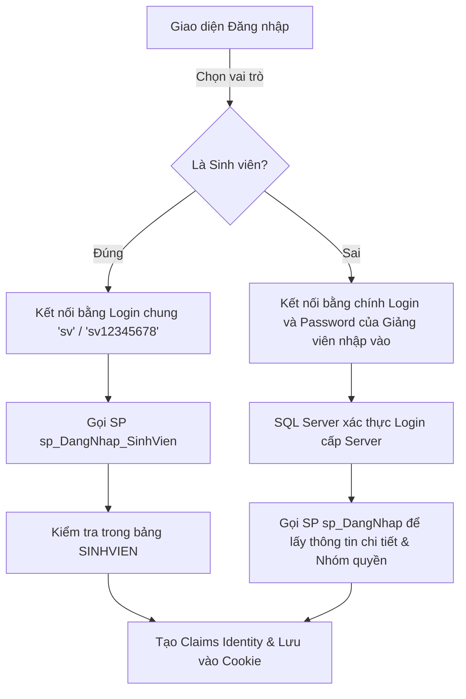

# Hướng Dẫn Về Cơ Chế Đăng Nhập, Phân Quyền & Bảo Mật Dự Án

Tài liệu này tổng hợp toàn bộ các cơ chế hoạt động liên quan đến Đăng nhập (Authentication), Phân quyền (Authorization), Quản lý Menu (Sidebar), và Xử lý lỗi CSDL đã được tối ưu hóa trong dự án.

---

## 1. Cơ Chế Hoạt Động Của Chức Năng Đăng Nhập (Login)

Hệ thống kết hợp giữa **Bảo mật mức Hệ quản trị CSDL (DBMS-level Security)** và **Bảo mật mức Ứng dụng (Application-level Security)** tùy theo đối tượng đăng nhập:



### A. Nhánh Giảng viên / Quản trị (DBMS-level Security)
* **Xác thực:** Chương trình lấy trực tiếp tên đăng nhập và mật khẩu giảng viên nhập vào để tạo chuỗi kết nối (ConnectionString) gửi đến SQL Server.
* **Cơ chế:** Nếu thông tin đăng nhập đúng, SQL Server cho phép mở kết nối. Sau đó, hệ thống thực thi Stored Procedure `sp_DangNhap` để lấy họ tên, khoa và nhóm quyền (`PGV`, `KHOA`, `PKT`) từ tài khoản SQL tương ứng. 
* **Ưu điểm:** Tận dụng trực tiếp khả năng phân quyền và giám sát (auditing) của hệ quản trị cơ sở dữ liệu SQL Server.

### B. Nhánh Sinh viên (Application-level Security)
* **Xác thực:** Hệ thống sử dụng một tài khoản SQL dùng chung có quyền tối thiểu tên là `sv` (mật khẩu `sv12345678`) để mở kết nối đến SQL Server.
* **Cơ chế:** Sau khi kết nối, hệ thống thực thi Stored Procedure `sp_DangNhap_SinhVien`, truyền vào `MASV` và `PASSWORD` do sinh viên nhập để đối chiếu trực tiếp với dữ liệu trong bảng `SINHVIEN`.

---

## 2. Cơ Chế Điều Hướng Khi Chưa Đăng Nhập Hoặc Chưa Có Quyền

### A. Chưa đăng nhập (Unauthenticated)
* Hệ thống đăng ký một bộ lọc phân quyền toàn cục (Global Filter) yêu cầu tất cả các URL đều phải xác thực (ngoại trừ trang Login):
  ```csharp
  var policy = new AuthorizationPolicyBuilder().RequireAuthenticatedUser().Build();
  options.Filters.Add(new AuthorizeFilter(policy));
  ```
* Nếu chưa đăng nhập mà cố truy cập các trang như `/class`, `/student`, hệ thống tự động điều hướng người dùng về trang đăng nhập:
  `/account/login?ReturnUrl=%2Fclass`

### B. Đã đăng nhập nhưng không đủ quyền (Unauthorized - 403 Forbidden)
* Các Controller được bảo vệ bằng thuộc tính phân quyền theo nhóm, ví dụ:
  ```csharp
  [Authorize(Roles = "PGV,KHOA")]
  public class ClassController : Controller
  ```
* Nếu một sinh viên (vai trò `SV`) truy cập `/class`, hệ thống sẽ chặn lại và tự động điều hướng đến trang báo lỗi không có quyền truy cập:
  `/access-denied`

---

## 3. Cơ Chế Hiển Thị Động Thanh Điều Hướng (Sidebar)

Thanh Sidebar hiển thị các chức năng khác nhau phù hợp với từng vai trò của người dùng dựa trên 3 lớp:

1. **Định nghĩa vai trò (`SidebarService.cs`):** 
   Từng mục menu được cấu hình danh sách vai trò (`Roles`) được phép nhìn thấy:
   * Chức năng "Lớp", "Môn học", "Nhập điểm"... dành cho: `["PGV", "KHOA"]`
   * Chức năng "Xem điểm", "Đăng ký tín chỉ"... dành cho: `["SV"]`
2. **Nhận diện quyền hiện tại (`ClaimsPrincipalExtensions.cs`):**
   Hệ thống đọc thông tin nhóm quyền được mã hóa trong Cookie đăng nhập thông qua phương thức `User.GetUserGroup()`.
3. **Lọc dữ liệu tại View (`_Sidebar.cshtml`):**
   Sử dụng LINQ để lọc danh sách mục menu trước khi kết xuất ra mã HTML:
   ```csharp
   @foreach (var item in menuItems.Where(m => m.Roles.Any(r => string.Equals(r, userGroup, StringComparison.OrdinalIgnoreCase))))
   ```
   ➔ Người dùng không có quyền tương ứng sẽ không nhận được bất kỳ mã HTML nào của mục menu đó trên trình duyệt (bảo mật tuyệt đối, không chỉ ẩn bằng CSS).

---

## 4. Cơ Chế Dịch Lỗi SQL Server Thành Tiếng Việt Thân Thiện

Hệ thống tích hợp lớp tiện ích `SqlErrorHelper` tại dự án `Infrastructure` để dịch các lỗi database kỹ thuật của SQL Server thành thông báo thân thiện cho người dùng cuối:

* **Mã lỗi `18456`:** Trả về `"Sai tài khoản hoặc mật khẩu."`
* **Mã lỗi `4060`:** Trả về `"Không thể mở cơ sở dữ liệu QLDSV_HTC. Vui lòng kiểm tra database đã được tạo chưa..."`
* **Mã lỗi kết nối (`2`, `53`, `258`, `10060`, `10061`):** Trả về `"Không thể kết nối đến máy chủ SQL Server. Vui lòng kiểm tra lại dịch vụ..."`
* **Mã lỗi phân quyền (`229`, `262`):** Trả về `"Tài khoản của bạn không có quyền thực hiện thao tác này."`
* **Mã lỗi trùng khóa (`2627`, `2601`):** Trả về `"Dữ liệu bị trùng lặp (khóa chính hoặc ràng buộc duy nhất đã tồn tại)."`
* **Mã lỗi khóa ngoại (`547`):** Trả về `"Thao tác thất bại do vi phạm ràng buộc dữ liệu liên quan (khóa ngoại)."`
* **Mã lỗi tự định nghĩa (`50000` - `RAISERROR`):** Trả về trực tiếp thông báo lỗi tùy chỉnh viết trong Stored Procedure (ví dụ: *"Mã sinh viên đã tồn tại."*, *"Mật khẩu phải chứa ít nhất 8 ký tự."*).

---

## 5. Ràng Buộc Mật Khẩu Tối Thiểu 8 Ký Tự

Ràng buộc bảo mật mật khẩu tối thiểu 8 ký tự được áp dụng đồng bộ ở 3 cấp:

1. **Cấp Cơ sở dữ liệu (Stored Procedures):**
   Các thủ tục thêm/sửa sinh viên (`sp_ThemSinhVien`, `sp_SuaSinhVien`) và thêm/sửa tài khoản giảng viên (`sp_TaoTaiKhoan`, `sp_SuaTaiKhoan`) đều tích hợp kiểm tra độ dài chuỗi:
   ```sql
   IF LEN(@PASSWORD) < 8
   BEGIN
       RAISERROR(N'Mật khẩu phải chứa ít nhất 8 ký tự.', 16, 1);
       RETURN;
   END
   ```
2. **Cấp Ứng dụng Web (C# ViewModels Validation):**
   Thêm thuộc tính validation trên các Model đầu vào để kiểm tra dữ liệu trước khi gửi đi:
   ```csharp
   [Required]
   [MinLength(8, ErrorMessage = "Mật khẩu phải chứa ít nhất 8 ký tự.")]
   public string Password { get; set; }
   ```
3. **Đồng bộ Dữ liệu mẫu (Seeds):**
   * Đổi giá trị mật khẩu mặc định của bảng `SINHVIEN` thành `12345678`.
   * Cập nhật mật khẩu mặc định của các tài khoản Admin/Giảng viên mẫu (`lcvinh123`, `ptquanh123`) và tài khoản kết nối chung của sinh viên (`sv12345678`) thông qua lệnh `ALTER LOGIN` cưỡng chế cập nhật trong tệp [001-PhanQuyen.sql](src/Database/Scripts/001-PhanQuyen.sql).
